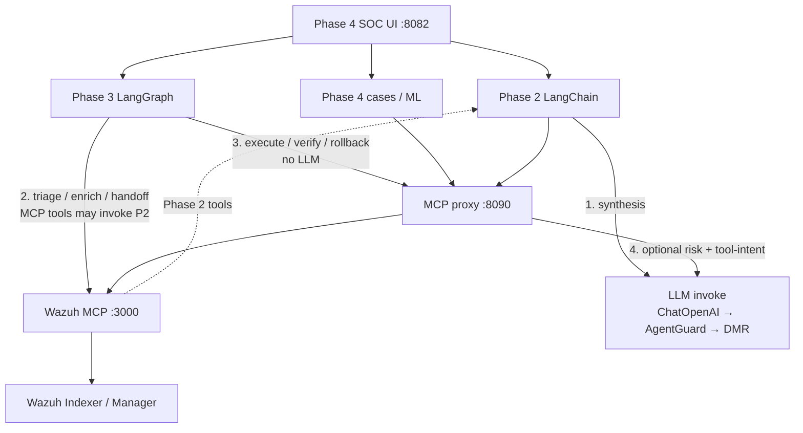
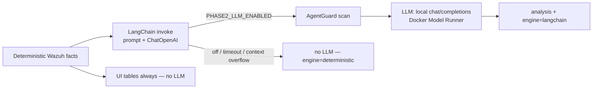
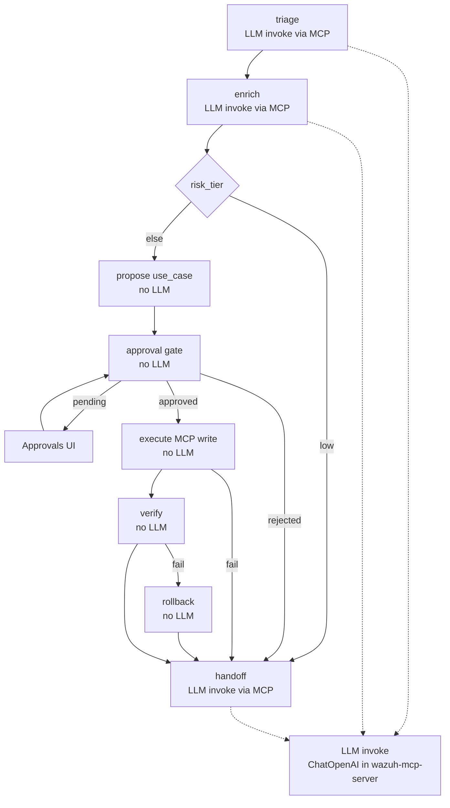
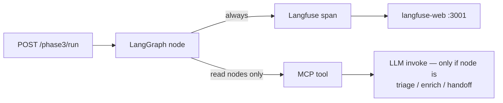

# SOC Governance

**Govern what an AI may do to a SIEM — not just what it may read.**

Agents can already query Wazuh and fire active responses (block an IP, isolate a host,
quarantine a file) through MCP. This repository adds the missing layer: **policy on who
may call which tool with which arguments, a human gate before any write, and an audit
trail that outlives the call.**

Phase 2 understands alerts without changing anything. Phase 3 changes the estate only
after approval. Phase 4 is the SOC console around both.

It is **not** a from-scratch MCP SIEM server. The tool surface is a fork of
[gensecaihq/Wazuh-MCP-Server](https://github.com/gensecaihq/Wazuh-MCP-Server) at **v4.2.1** (MIT).
Everything listed under Original work below is by **Serguei Fedotov**.

**Functionality and architecture (leading document):**
[docs/OVERVIEW.md](docs/OVERVIEW.md) — Phase 2 / 3 / 4, LangChain, LangGraph, Langfuse,
source map. First-run: [docs/OPERATIONS.md](docs/OPERATIONS.md#first-run-local-stack).

Related: [rag-protection](https://github.com/marifort/rag-protection) governs what an AI may **read**.
The MCP tool-call gateway lives in-tree at [`mcp-security-proxy/`](mcp-security-proxy/). This repo is
the full SOC stack around that gateway.

## LLM frameworks in the SOC path

The interesting work is not “call a chat model.” It is **where** the model is allowed to speak,
**which library** owns that step, and **what still runs when the model fails**.

| Framework | Phase | What I used it for |
|---|---|---|
| **LangChain** | 2 | `ChatPromptTemplate` → `ChatOpenAI` (OpenAI-compatible local endpoint) → `StrOutputParser` for analyst narratives; compact-retry then **deterministic fallback** |
| **LangGraph** | 3 | `StateGraph` with conditional edges: human-in-the-loop pause, execute / verify / rollback; separate investigation playbooks that **recommend only** |
| **Langfuse** | 3 | Optional OSS traces: one root `phase3_workflow` plus a child span per graph node (`trace_id` on the API response) |

Phase 3 does **not** import LangChain. Action choice is a `use_case` map, not an LLM. When the graph calls `triage_wazuh_alerts`, LangChain may still run **inside** the MCP server. The proxy can use LangChain separately for tool-intent / LLM-risk on every `tools/call`.

### Governed stack

Phase 4 is the console. Phase 2 is read-only synthesis. Phase 3 is the only intended write path, still behind the MCP proxy. **LLM invoke** is a local `chat/completions` call (LangChain `ChatOpenAI` → AgentGuard → Docker Model Runner). Writes never go through that path.



### LangChain (Phase 2) — synthesis with a hard fallback

Facts are gathered in Python first. LangChain only writes the narrative card. Tables still render if `PHASE2_LLM_ENABLED=false`, AgentGuard/DMR is down, or the context window overflows (compact and ultra-compact retries, then `engine=deterministic`).



Enable: `PHASE2_LLM_ENABLED=true` and `PHASE2_LLM_BASE_URL=http://agentguard:8088/v1/proxy/openai/v1`. Verify: `data.orchestration.engine` or `bash tools/verify_phase2_langchain.sh`.

### LangGraph (Phase 3) — human-in-the-loop writes

Three compiled graphs: guarded write (`POST /phase3/run`), incident grouping, and investigation playbooks (`brute_force`, `beaconing`, `malware`, `privilege_escalation`, `exfiltration`). Playbooks **do not execute** containment; they return a `proposed_action` for `/phase3/run`.

Solid arrows that say **LLM invoke** call Phase 2 tools (`triage_wazuh_alerts`, `enrich_wazuh_context`, `generate_soc_handoff_report`) and may hit ChatOpenAI. Propose / approve / execute / verify / rollback do **not** call a model.



`block_ip` / `isolate_host` / `quarantine_file` each have matching verify and rollback MCP tools.

### Langfuse (Phase 3) — node-level traces

Optional overlay (`compose.langfuse.oss.yml`). Not started by `start-profile.sh C`. Each node in the write graph emits a child observation; the run response includes `outputs.trace.trace_id`. Langfuse does not own approval state or Wazuh execution.

Langfuse records **graph nodes**, not the ChatOpenAI generation. If triage/enrich/handoff invoked an LLM, that call still happened in `wazuh-mcp-server`; Langfuse only sees that the node ran.



Full diagrams, env vars, and source map: [docs/OVERVIEW.md](docs/OVERVIEW.md#3-langchain-langgraph-and-langfuse).

## Original work

| Layer | What it is |
|---|---|
| **Phase 2** (`phase2.py`) | **Read-only.** Triage, enrich, shift handoff. Structured tables always; optional LangChain narrative via AgentGuard. Never calls write tools. SOC UI: Triage / Enrich / SOC Report |
| **Phase 3** (`services/phase3_langgraph/`) | **Human-gated writes.** `block_ip` / `isolate_host` / `quarantine_file` → execute, verify, rollback. Pauses on Approvals unless `auto_approve` |
| **Phase 4** (`phase4/`) | **Case ops + UI.** Incidents/SLA, Alerts fetch, playbooks, Neo4j/OpenCTI, ML, and the SOC console that hosts Phase 2 and 3 (`:8082/ui`) |
| **MCP security proxy** (`mcp-security-proxy/`) | Per-call policy on MCP JSON-RPC: allowlist, denied tools, intent/risk, audit — sits in front of every phase's tool calls |
| **Isolated executor** | Sidecar for constrained tool execution (demo allow-list — not gVisor) |
| **AgentGuard** (`agentic-ai-firewall/`) | Inbound/outbound LLM firewall for Phase 2 synthesis — **Apache-2.0**, not MIT |
| **Full-stack compose** | Local Wazuh + MCP + Open WebUI + overlays for Phase 3/4/OpenCTI |

The MCP Python package is still named `wazuh_mcp_server` so the fork stays import-compatible.

## Quick start (local SOC stack)

Docker Desktop 4.40+ with Model Runner enabled. Demo Wazuh credentials are the upstream image
defaults — **local only**. Full first-run notes: [docs/OPERATIONS.md](docs/OPERATIONS.md#first-run-local-stack).

### 1. Create `.env` with a valid MCP API key

```bash
cp .env.example .env
python3 -c "import secrets; print('wazuh_' + secrets.token_urlsafe(32))"
```

Paste the printed value into `MCP_API_KEY=` in `.env`. It **must** be `wazuh_` plus 43 URL-safe
characters (49 characters total). The placeholder `CHANGE_ME` and `openssl rand -hex 32` are
**not** valid — Wazuh MCP ignores them, auto-generates an unlogged key, and **Fetch Alerts**
fails with `401 Invalid or expired token`.

### 2. Start Profile C

```bash
bash tools/start-profile.sh C
```

Reuse images on later boots with `--no-build`. Profiles A–D: [docs/LOCAL_OPTIMIZATION_AND_PROFILES.md](docs/LOCAL_OPTIMIZATION_AND_PROFILES.md).

`start-profile.sh` now passes repo-root `.env` into the MCP proxy stack and sets
`MCP_PROXY_UPSTREAM_API_KEY` from the running `wazuh-mcp-server` key. If Alerts still 401s:

```bash
bash tools/align_mcp_proxy_upstream_key.sh
```

### 3. Open the SOC UI and fetch alerts

| URL | Service |
|---|---|
| http://localhost:8082/ui | Phase 4 SOC UI (Alerts, Incidents, Approvals) |
| http://localhost:8090/ui | MCP proxy operate UI |
| http://localhost:3000/mcp | Wazuh MCP server |
| http://localhost:3100 | Open WebUI |
| https://localhost:8443 | Wazuh Dashboard (self-signed) |
| http://localhost:8081 | Phase 3 LangGraph API |
| http://localhost:8083 | OpenCTI UI |
| http://localhost:3002 | Grafana |
| http://localhost:9091 | Prometheus |

On first indexer startup, wait ~2 minutes, then in the SOC UI open **Alerts** → **Fetch Alerts**.
Or:

```bash
curl -sS -X POST http://localhost:8082/alerts/fetch \
  -H 'Content-Type: application/json' \
  -d '{"time_range":"24h","level":"5+","limit":5}'
```

A red banner that only mentions `localhost:8090` connection refused is usually a **later
fallback**. Check `docker logs phase4-api` for the earlier `401 Invalid or expired token` from
`http://mcp-security-proxy:8090/mcp`, then run the align script above.

Forked MCP server walkthrough (tools, Claude Desktop, air-gap): [docs/WAZUH_MCP_FORK.md](docs/WAZUH_MCP_FORK.md).

### Overlays (without the profile wrapper)

```bash
# Human-gated write workflow
docker compose -f compose.full.yml -f compose.phase3.langgraph.yml up -d

# Incidents + Neo4j forensics + SOC UI (Neo4j Community)
docker compose -f compose.full.yml -f compose.phase4.yml up -d

# Optional OpenCTI (pulls published images; this repo does not vendor OpenCTI source)
docker compose -f compose.full.yml -f compose.phase4.yml -f compose.opencti.yml up -d
```

Manual overlay starts do **not** bring up the MCP proxy or align keys. Prefer `start-profile.sh`
for the SOC UI Alerts tab.

### Proxy only

```bash
cd mcp-security-proxy
python3 -m venv .venv && source .venv/bin/activate
pip install -r requirements.txt
uvicorn mcp_security_proxy.app:app --port 8090
```

Or run the gateway from this tree (`mcp-security-proxy/`) as above.

## Tests

```bash
cd mcp-security-proxy && pip install -r requirements.txt -r requirements-dev.txt && pytest -q
```

## Licence

**MIT** — Copyright (c) 2026 [Serguei Fedotov](https://github.com/sergueifedotov)
and Copyright (c) 2024 **Wazuh MCP Server Contributors**. See [LICENSE](LICENSE)
and [NOTICE](NOTICE).

`agentic-ai-firewall/` remains **Apache-2.0**.
