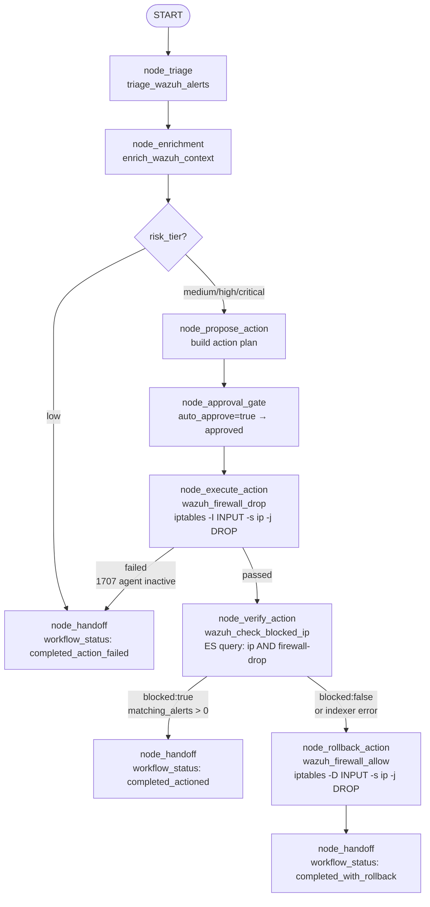
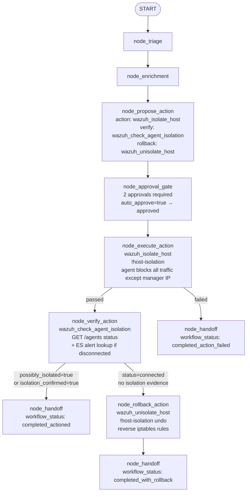
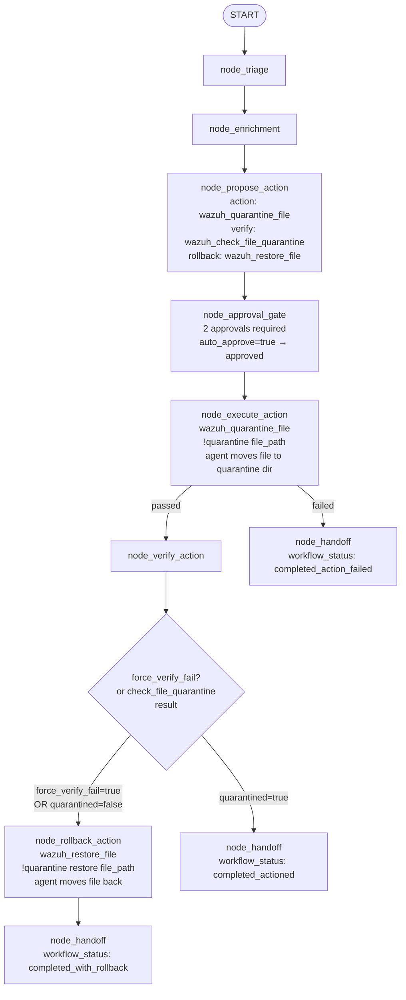

# LangGraph Phase 3 Guide (Guarded Write Actions)

This guide implements Phase 3 as a separate LangGraph companion service.

Design boundary:
- Wazuh MCP Server remains the tool backend.
- LangGraph service orchestrates read-only context, approvals, write actions, verification, rollback, and handoff.

## 1) What gets deployed

- Service: `phase3-langgraph`
- Source: `services/phase3_langgraph`
- Overlay compose file: `compose.phase3.langgraph.yml`
- Optional OSS tracing overlay: `compose.langfuse.oss.yml`
- Demo runner: `tools/demo_phase3_langgraph.sh`
- Enhancement smoke runner: `tools/smoke_phase3_enhancements.sh`
- Smoke-test endpoint agent: `wazuh-agent-003` (custom image pinned to Wazuh agent `4.8.0`)

## 1.1) Enhancement implementation status

The following Phase 3 enhancements are implemented and validated in this repository:

| Enhancement | Implementation status | Code locations |
|---|---|---|
| Tenacity smart retries | Implemented | `services/phase3_langgraph/app/main.py` (`@retry` on `_mcp_call`) |
| Structlog audit logging | Implemented (approval, pending/resumed, execution, verify, rollback) | `services/phase3_langgraph/app/audit_logging.py`, call sites in `services/phase3_langgraph/app/main.py` |
| Parallel execution | Implemented via `proposed_actions` and `asyncio.gather` | `services/phase3_langgraph/app/main.py` (`RunPhase3Request.proposed_actions`, `node_execute_action`) |
| Langfuse OSS tracing | Implemented for workflow root traces, node-level child spans, response trace metadata, and self-hosted OSS backend validation | `services/phase3_langgraph/app/main.py` (`_start_langfuse_trace`, `_finish_langfuse_trace`, `_start_langfuse_child_observation`, `_finish_langfuse_child_observation`, `_build_outputs`) |
| Human-in-the-loop approvals | Implemented with pause and explicit resume API | `services/phase3_langgraph/app/main.py` (`/phase3/approvals/{incident_id}`, `/phase3/approvals/{incident_id}/resume`) |

## 1.2) Langfuse architecture and hook model

Langfuse is wired into Phase 3 as an optional tracing plane for the LangGraph companion service. The Wazuh MCP server remains the execution backend. Langfuse records orchestration telemetry only.

Architecture layers:

- `phase3-langgraph` emits workflow traces and node spans
- `langfuse-web` provides the UI and public/private API
- `langfuse-worker` processes async ingestion work
- `langfuse-postgres`, `langfuse-clickhouse`, `langfuse-redis`, and `langfuse-minio` back the OSS deployment
- `wazuh-mcp-server` remains the tool endpoint invoked by Phase 3 via JSON-RPC

Tracing lifecycle in the Phase 3 service:

1. `run_phase3()` builds initial workflow state and calls `_start_langfuse_trace()`
2. `_start_langfuse_trace()` creates one root trace named `phase3_workflow`
3. Each workflow node calls `_start_langfuse_child_observation()` before work begins
4. Each node calls `_finish_langfuse_child_observation()` with success or error output
5. `_finish_langfuse_trace()` updates the root trace with `workflow_status`, `steps`, and `approval`
6. `_build_outputs()` exposes trace metadata in the API response so the exact `trace_id` can be verified externally

Current hook functions in `services/phase3_langgraph/app/main.py`:

- `_get_langfuse_client()` lazily initializes the SDK client from environment variables
- `_start_langfuse_trace()` creates the root trace and stores SDK objects in `trace_info`
- `_finish_langfuse_trace()` writes final workflow output to the root trace and flushes the client
- `_start_langfuse_child_observation()` creates node-level spans using the parent trace object, direct `trace_id`, or observation API fallback depending on SDK mode
- `_finish_langfuse_child_observation()` records node output and marks error state when exceptions occur
- `_build_outputs()` returns `provider`, `enabled`, `trace_id`, `child_observations_started`, `child_observation_names`, and `error`

Current traced node names:

- `node_triage`
- `node_enrichment`
- `node_propose_action`
- `node_approval_gate`
- `node_execute_action`
- `node_verify_action`
- `node_rollback_action`
- `node_handoff`

Metadata carried on the root trace:

- `incident_id`
- `risk_tier`
- `use_case`

What Langfuse does not do here:

- It does not replace Wazuh execution or approval logic
- It does not persist business state used for workflow resume; that remains in the Phase 3 service
- It does not validate that a Wazuh action succeeded on-host; it records orchestration telemetry and node outcomes

---

## 1.3) End-to-end smoke test for enhancements

Use the dedicated enhancement smoke script when you want explicit validation of the enhancement behavior, not just scenario demos.

Run:

```bash
bash tools/smoke_phase3_enhancements.sh
```

Optional environment overrides:

```bash
PHASE3_BASE_URL=http://localhost:8081 \
MCP_BASE_URL=http://localhost:3000 \
PHASE3_DEMO_AGENT_ID=agent003 \
bash tools/smoke_phase3_enhancements.sh
```

What the smoke script validates:

1. Critical parallel execution succeeds (`proposed_actions` path)
2. Critical verify failure triggers rollback (`force_verify_fail: true` path)
3. Human-in-the-loop pause + resume approved path
4. Human-in-the-loop pause + resume rejected path
5. Traced run endpoint path (`POST /phase3/run`) with Langfuse trace assertion
6. Structlog audit emission paths through approval/execute/verify/rollback nodes

Note on parallel validation:

- The script validates that the parallel execution branch is used and that parallel action/result structures are returned.
- In some environments, one parallel sub-action may fail (for example, user-disable action unavailable) while others succeed; this still confirms the parallel enhancement path is functioning.

Langfuse trace assertion requirements:

- `LANGFUSE_ENABLED=true` in `phase3-langgraph`.
- `LANGFUSE_PUBLIC_KEY` and `LANGFUSE_SECRET_KEY` must be configured.
- Optional: `LANGFUSE_ASSERT_TRACE=false` to skip trace assertion in smoke tests.

Expected terminal result:

```text
Phase 3 enhancement smoke test passed
```

If services are down, the script exits non-zero with clear preflight errors.

## 2) Start the service with separate Docker service

Start your full stack and the dedicated 4.8 smoke-test agent first:

```bash
docker compose -f compose.full.yml up -d --build wazuh.indexer wazuh.manager wazuh.dashboard wazuh-mcp-server wazuh-agent-003
```

Then add the LangGraph companion:

```bash
docker compose -f compose.full.yml -f compose.phase3.langgraph.yml up -d --build phase3-langgraph
```

Optional: start OSS Langfuse in the same Docker environment and link Phase 3 tracing to it:

```bash
export LANGFUSE_ENABLED=true
export LANGFUSE_PUBLIC_KEY=<your_langfuse_public_key>
export LANGFUSE_SECRET_KEY=<your_langfuse_secret_key>
export LANGFUSE_HOST=http://langfuse-web:3000

docker compose \
  -f compose.full.yml \
  -f compose.phase3.langgraph.yml \
  -f compose.langfuse.oss.yml \
  up -d --build phase3-langgraph langfuse-web langfuse-worker
```

This overlay:

- Adds local OSS Langfuse services (`langfuse-web`, `langfuse-worker`, Postgres, ClickHouse, Redis, MinIO).
- Wires `phase3-langgraph` to `LANGFUSE_HOST=http://langfuse-web:3000`.
- Keeps trace name `phase3_workflow` unchanged.

Notes:

- If `LANGFUSE_ENABLED=false`, tracing is disabled.
- For air-gapped/offline runs, keep `LANGFUSE_ASSERT_TRACE=true` if `langfuse-web` is reachable on the Compose network.

Check health:

```bash
curl -sS http://localhost:8081/health | python3 -m json.tool
```

Inspect available level behaviors:

```bash
curl -sS http://localhost:8081/use-cases | python3 -m json.tool
```

## 2.1) Langfuse build and deployment guide

The Langfuse integration is shipped as a Docker Compose overlay. You do not build a separate local Python environment for Langfuse inside this repository unless you are editing the Phase 3 service itself.

Phase 3 service build facts:

- Image build context: `services/phase3_langgraph`
- Base image: `python:3.12-slim`
- Runtime entrypoint: `uvicorn app.main:app --host 0.0.0.0 --port 8081`
- Langfuse SDK pin: `langfuse>=2.56.0,<3.0.0`

The `langfuse<3.0.0` pin is intentional. This repository targets a self-hosted Langfuse OSS v2 backend. The service code contains compatibility branches for both v2 and v3-style SDK usage, but the validated local stack is the v2 OSS deployment defined in `compose.langfuse.oss.yml`.

Recommended local build order:

1. Start the base Wazuh and MCP stack
2. Start `phase3-langgraph`
3. Start Langfuse OSS overlay and rebuild `phase3-langgraph` with tracing env vars exported

Minimal traced bring-up:

```bash
export LANGFUSE_ENABLED=true
export LANGFUSE_PUBLIC_KEY=pk-local-smoke
export LANGFUSE_SECRET_KEY=sk-local-smoke

docker compose \
  -f compose.full.yml \
  -f compose.phase3.langgraph.yml \
  -f compose.langfuse.oss.yml \
  up -d --build phase3-langgraph langfuse-web langfuse-worker
```

If you want the full lab plus traced Phase 3 in one environment:

```bash
export LANGFUSE_ENABLED=true
export LANGFUSE_PUBLIC_KEY=pk-local-smoke
export LANGFUSE_SECRET_KEY=sk-local-smoke

docker compose \
  -f compose.full.yml \
  -f compose.phase3.langgraph.yml \
  -f compose.langfuse.oss.yml \
  up -d --build wazuh.indexer wazuh.manager wazuh.dashboard wazuh-mcp-server wazuh-agent-003 phase3-langgraph langfuse-web langfuse-worker
```

Check traced service status:

```bash
docker compose -f compose.full.yml -f compose.phase3.langgraph.yml -f compose.langfuse.oss.yml ps --all
```

Expected exposed ports in the local lab:

- Phase 3 API: `http://localhost:8081`
- Langfuse UI and API: `http://localhost:3001`
- Wazuh MCP server: `http://localhost:3000`

## 2.2) Langfuse operator guide

Use this sequence when you want to confirm tracing from the API response all the way into the Langfuse UI.

Bootstrap defaults from `compose.langfuse.oss.yml`:

- Organization id: `local-org`
- Organization name: `Local Org`
- Project id: `local-project`
- Project name: `local-project`
- Bootstrap public key: `pk-local-smoke`
- Bootstrap secret key: `sk-local-smoke`
- Bootstrap user email: `local-admin@example.com`
- Bootstrap user password: `local-admin-password`

UI workflow:

1. Open `http://localhost:3001`
2. Sign in with `local-admin@example.com` / `local-admin-password` unless you overrode them
3. Open project `local-project`
4. Go to the traces view
5. Filter by trace name `phase3_workflow` if needed
6. Open the latest trace for your `incident_id`
7. Inspect the observation timeline to confirm node-level spans

What you should see in a healthy traced run:

- One root trace named `phase3_workflow`
- Root metadata with `incident_id`, `risk_tier`, and `use_case`
- Child observations matching the executed workflow path
- Final output showing `workflow_status`, `steps`, and `approval`

Low-risk read-only path should show these child spans:

- `node_triage`
- `node_enrichment`
- `node_handoff`

Critical rollback path should show these child spans:

- `node_triage`
- `node_enrichment`
- `node_propose_action`
- `node_approval_gate`
- `node_execute_action`
- `node_verify_action`
- `node_rollback_action`
- `node_handoff`

If you already have a `trace_id`, you can jump directly to the UI detail page using this pattern:

```text
http://localhost:3001/project/local-project/traces/<trace_id>
```

## 2.3) Langfuse smoke test and proof workflow

There are two useful levels of validation:

- Scripted enhancement smoke coverage
- Direct trace proof for a specific workflow run

### A. Scripted smoke coverage

Run the repository smoke script:

```bash
bash tools/smoke_phase3_enhancements.sh
```

This validates that the traced endpoint path is exercised and that the response contains Langfuse trace metadata when tracing is enabled.

Required environment for trace assertion:

```bash
export LANGFUSE_ENABLED=true
export LANGFUSE_PUBLIC_KEY=pk-local-smoke
export LANGFUSE_SECRET_KEY=sk-local-smoke
```

Optional smoke-script lookup overrides:

```bash
export LANGFUSE_PUBLIC_BASE_URL=http://localhost:3001
export LANGFUSE_PUBLIC_KEY=pk-local-smoke
export LANGFUSE_SECRET_KEY=sk-local-smoke
```

Smoke-script lookup variables:

| Variable | Default | Purpose |
|---|---|---|
| `LANGFUSE_ASSERT_TRACE` | `true` | Enable or skip Langfuse assertions in `tools/smoke_phase3_enhancements.sh` |
| `LANGFUSE_PUBLIC_BASE_URL` | `http://localhost:3001` | Base URL used by the smoke script to query the Langfuse public trace API |
| `LANGFUSE_PUBLIC_KEY` | `pk-local-smoke` | Langfuse project public key used by the smoke script for backend trace lookup |
| `LANGFUSE_SECRET_KEY` | `sk-local-smoke` | Langfuse project secret key used by the smoke script for backend trace lookup |

Optional override to skip backend trace assertion:

```bash
export LANGFUSE_ASSERT_TRACE=false
```

### B. Direct proof from API response to Langfuse backend

Run a traced Phase 3 workflow:

```bash
curl -fsS http://localhost:8081/phase3/run \
  -H "Content-Type: application/json" \
  -d '{
    "incident_id": "INC-SPAN-PROOF-CRIT-1",
    "risk_tier": "critical",
    "use_case": "quarantine_file",
    "time_range": "6h",
    "auto_approve": true,
    "force_verify_fail": true,
    "action_args": {
      "agent_id": "004",
      "file_path": "/tmp/suspicious.bin"
    }
  }' | jq '.outputs.trace'
```

Expected response fields:

- `enabled: true`
- non-empty `trace_id`
- `child_observations_started` greater than `0`
- `child_observation_names` matching the executed nodes

Fetch the exact trace from Langfuse public API using the returned `trace_id`:

```bash
curl -fsS -u 'pk-local-smoke:sk-local-smoke' \
  'http://localhost:3001/api/public/traces/<trace_id>' | jq '{id,name,observations_count:(.observations|length),observation_names:(.observations|map(.name))}'
```
curl -fsS -u 'pk-local-smoke:sk-local-smoke' \
  'http://localhost:3001/api/public/traces/001425a8-c3fb-4a31-8def-2092f61ab6ac' | jq '{id,name,observations_count:(.observations|length),observation_names:(.observations|map(.name))}'

This is the strongest local proof because it verifies all three layers:

1. Phase 3 returned the trace metadata
2. Langfuse stored the root trace by the same id
3. Langfuse stored child observations for executed nodes

## 2.4) Langfuse response contract

Every `POST /phase3/run` response includes an `outputs.trace` object. That payload is the operator hand-off point between Phase 3 and Langfuse.

Fields:

| Field | Meaning |
|---|---|
| `provider` | Always `langfuse` in the current implementation |
| `enabled` | Whether tracing was active for the run |
| `trace_id` | The exact Langfuse trace id for backend/UI lookup |
| `child_observations_started` | Count of child spans successfully started by the workflow |
| `child_observation_names` | Ordered list of node span names started during the run |
| `error` | SDK or flush error if tracing partially failed |

Example:

```json
{
  "provider": "langfuse",
  "enabled": true,
  "trace_id": "<trace_id>",
  "child_observations_started": 8,
  "child_observation_names": [
    "node_triage",
    "node_enrichment",
    "node_propose_action",
    "node_approval_gate",
    "node_execute_action",
    "node_verify_action",
    "node_rollback_action",
    "node_handoff"
  ],
  "error": null
}
```

## 2.5) Troubleshooting Langfuse integration

| Symptom | Likely cause | Check |
|---|---|---|
| `outputs.trace.enabled` is `false` | `LANGFUSE_ENABLED` unset or keys missing | Confirm `LANGFUSE_ENABLED=true`, `LANGFUSE_PUBLIC_KEY`, `LANGFUSE_SECRET_KEY` in `phase3-langgraph` env |
| `trace_id` is empty | SDK client was not created | Check Phase 3 logs for import/auth errors and confirm the key pair matches the Langfuse project |
| Root trace exists but no child observations | Old service image without node span hooks | Rebuild `phase3-langgraph` with the current code and rerun the workflow |
| UI login fails | Bootstrap credentials overridden | Check the effective `LANGFUSE_INIT_USER_*` values in your compose env |
| API lookup returns 401 | Wrong public/secret key pair | Use the project keys configured in `compose.langfuse.oss.yml` or your overridden env |
| API lookup returns 404 | Wrong `trace_id` or trace not flushed yet | Re-run the workflow, use the returned `trace_id`, then retry after the request completes |
| `error` field populated in `outputs.trace` | SDK update or flush exception | Inspect Phase 3 service logs; the workflow can still complete even if tracing degraded |

## 2.6) Langfuse environment variable reference

This section consolidates the Langfuse-related variables used by the Phase 3 service, the smoke script, and the self-hosted OSS overlay.

### Phase 3 service tracing variables

These variables are consumed by `phase3-langgraph`.

| Variable | Default | Purpose |
|---|---|---|
| `LANGFUSE_ENABLED` | `false` in `compose.phase3.langgraph.yml`, `true` in `compose.langfuse.oss.yml` | Enable Langfuse tracing in the Phase 3 service |
| `LANGFUSE_HOST` | `http://langfuse-web:3000` | Internal Langfuse endpoint used by the Python SDK |
| `LANGFUSE_PUBLIC_KEY` | empty | Langfuse project public key used for trace ingestion |
| `LANGFUSE_SECRET_KEY` | empty | Langfuse project secret key used for trace ingestion |
| `LANGFUSE_TRACE_NAME` | `phase3_workflow` | Root trace name created for workflow runs |

### Smoke-test trace assertion variables

These variables are consumed by `tools/smoke_phase3_enhancements.sh`.

| Variable | Default | Purpose |
|---|---|---|
| `LANGFUSE_ASSERT_TRACE` | `true` | Enable backend trace validation during smoke tests |
| `LANGFUSE_PUBLIC_BASE_URL` | `http://localhost:3001` | Langfuse public API base URL used by the smoke script |
| `LANGFUSE_PUBLIC_KEY` | `pk-local-smoke` | Public key used by the smoke script for API lookup |
| `LANGFUSE_SECRET_KEY` | `sk-local-smoke` | Secret key used by the smoke script for API lookup |

### OSS overlay UI, bootstrap, and project variables

These variables configure the self-hosted Langfuse web service in `compose.langfuse.oss.yml`.

| Variable | Default | Purpose |
|---|---|---|
| `LANGFUSE_PORT` | `3001` | Host port mapped to the Langfuse web container |
| `LANGFUSE_PUBLIC_URL` | `http://localhost:3001` | External/public URL used by Langfuse auth flows |
| `LANGFUSE_NEXTAUTH_SECRET` | `change_me_langfuse_nextauth_secret` | Session/auth secret for Langfuse web |
| `LANGFUSE_SALT` | `change_me_langfuse_salt` | Langfuse application salt |
| `LANGFUSE_INIT_ORG_ID` | `local-org` | Initial organization id created at bootstrap |
| `LANGFUSE_INIT_ORG_NAME` | `Local Org` | Initial organization display name |
| `LANGFUSE_INIT_PROJECT_ID` | `local-project` | Initial project id |
| `LANGFUSE_INIT_PROJECT_NAME` | `local-project` | Initial project display name |
| `LANGFUSE_INIT_USER_EMAIL` | `local-admin@example.com` | Bootstrap user email |
| `LANGFUSE_INIT_USER_NAME` | `Local Admin` | Bootstrap user display name |
| `LANGFUSE_INIT_USER_PASSWORD` | `local-admin-password` | Bootstrap user password |
| `LANGFUSE_TELEMETRY_ENABLED` | `false` | Enable or disable Langfuse upstream telemetry |

Notes:

- `LANGFUSE_INIT_PROJECT_PUBLIC_KEY` and `LANGFUSE_INIT_PROJECT_SECRET_KEY` are wired from `LANGFUSE_PUBLIC_KEY` and `LANGFUSE_SECRET_KEY` in the overlay.
- In production, `LANGFUSE_NEXTAUTH_SECRET`, `LANGFUSE_SALT`, and `LANGFUSE_INIT_USER_PASSWORD` should always be overridden.

### OSS overlay database, queue, and object storage variables

These variables configure the backing services used by the self-hosted Langfuse stack.

| Variable | Default | Purpose |
|---|---|---|
| `LANGFUSE_POSTGRES_DB` | `langfuse` | Langfuse Postgres database name |
| `LANGFUSE_POSTGRES_USER` | `langfuse` | Langfuse Postgres username |
| `LANGFUSE_POSTGRES_PASSWORD` | `langfuse` | Langfuse Postgres password |
| `LANGFUSE_CLICKHOUSE_USER` | `default` | ClickHouse username |
| `LANGFUSE_CLICKHOUSE_PASSWORD` | `langfuse` | ClickHouse password |
| `LANGFUSE_CLICKHOUSE_DB` | `default` | ClickHouse database |
| `LANGFUSE_MINIO_ROOT_USER` | `minio` | MinIO root/access user |
| `LANGFUSE_MINIO_ROOT_PASSWORD` | `minio123` | MinIO root/access password |
| `LANGFUSE_S3_EVENT_UPLOAD_BUCKET` | `langfuse` | Bucket used for Langfuse event uploads |
| `LANGFUSE_S3_EVENT_UPLOAD_REGION` | `us-east-1` | Region label for S3-compatible event uploads |

Notes:

- `REDIS_CONNECTION_STRING`, `CLICKHOUSE_URL`, `CLICKHOUSE_MIGRATION_URL`, `S3_EVENT_UPLOAD_ENDPOINT`, and `S3_EVENT_UPLOAD_FORCE_PATH_STYLE` are fixed by the overlay and normally do not need overriding in the local lab.
- If you change object-storage or database credentials, keep the corresponding web and worker values aligned.

## 3) Phase 3 levels and use cases

| Level | Primary behavior | Example use case | Action flow |
|------|------|------|------|
| `low` | Read-only only | noisy scan bursts with weak confidence | triage -> enrich -> handoff |
| `medium` | Single-approval containment | block brute-force source IP | triage -> enrich -> propose -> approve -> execute -> verify -> handoff |
| `high` | Strongly controlled host action | isolate compromised endpoint | triage -> enrich -> propose -> approve -> execute -> verify -> (rollback on failure) -> handoff |
| `critical` | Strict containment with rollback guarantees | quarantine suspicious malware artifact | triage -> enrich -> propose -> approve -> execute -> verify -> rollback (if failed) -> handoff |

## 4) Demo script — `tools/demo_phase3_langgraph.sh`

### Overview

`tools/demo_phase3_langgraph.sh` is the single entry point for running Phase 3 scenarios end-to-end from the command line. It:

1. Resolves the MCP API key from `MCP_API_KEY` env var or the repo-root `.env` file.
2. Queries `get_wazuh_running_agents` via MCP to auto-select the first active non-manager agent.
3. POSTs the appropriate incident payload to `POST /phase3/run` on the LangGraph service.
4. Pipes the JSON response through `tools/format_phase3_output.py` for structured, human-readable output.

### Prerequisites

| Requirement | Default | Override |
|---|---|---|
| LangGraph service running | `http://localhost:8081` | `PHASE3_BASE_URL=` |
| MCP server running | `http://localhost:3000` | `MCP_BASE_URL=` |
| MCP API key | read from `.env` `MCP_API_KEY=` | `MCP_API_KEY=` env var |
| Active non-manager agent | auto-discovered via MCP | `PHASE3_DEMO_AGENT_ID=` |

### Agent auto-discovery

On every invocation the script calls `get_wazuh_running_agents` and selects an agent using this fallback chain:

1. `PHASE3_DEMO_AGENT_ID` env var — accepts a **numeric id** (e.g. `004`) or an **agent name** (e.g. `agent003`); used only if the agent is currently active
   - When a name is given, the script resolves it to the current numeric id automatically and prints an `INFO:` line
2. First active non-manager agent (status = `active`, id ≠ `000`)
3. First active agent of any kind (including `000`)
4. Hard-coded fallback `002` — used when MCP is unreachable or no key is available

If `PHASE3_DEMO_AGENT_ID` is set but inactive (or the name/id is not found), the script warns and automatically falls back to discovery.

Set `PHASE3_STRICT_AGENT_ID=true` to fail fast instead of falling back.

> **Warning:** If only the manager (`000`) is active, a warning is printed and medium/high/critical scenarios will return `completed_action_failed` because active-response commands cannot target the manager.

### Usage

```bash
# Show help
bash tools/demo_phase3_langgraph.sh --help

# Run all four scenarios sequentially (auto-discover agent)
bash tools/demo_phase3_langgraph.sh all

# Run all scenarios (recommended: let auto-discovery pick the active non-manager agent)
bash tools/demo_phase3_langgraph.sh all

# Optional: pin a specific agent by numeric id (if you know it is active)
PHASE3_DEMO_AGENT_ID=004 bash tools/demo_phase3_langgraph.sh all

# Or pin by agent name — the script resolves the current numeric id automatically
PHASE3_DEMO_AGENT_ID=agent003 bash tools/demo_phase3_langgraph.sh all

# Strict mode: fail fast if the pinned id/name is not active
PHASE3_DEMO_AGENT_ID=agent003 PHASE3_STRICT_AGENT_ID=true bash tools/demo_phase3_langgraph.sh all

# Check active agents and current numeric id for agent003
MCP_KEY="${MCP_API_KEY:-$(grep '^MCP_API_KEY=' .env | cut -d= -f2- | head -n1)}"
curl -fsS http://localhost:3000/ \
  -H "Authorization: Bearer ${MCP_KEY}" \
  -H "Content-Type: application/json" \
  -d '{"jsonrpc":"2.0","id":"agent-check","method":"tools/call","params":{"name":"get_wazuh_running_agents","arguments":{}}}' | jq

# Run a single scenario (by name — resolves to current numeric id automatically)
PHASE3_DEMO_AGENT_ID=agent003 bash tools/demo_phase3_langgraph.sh low-readonly
PHASE3_DEMO_AGENT_ID=agent003 bash tools/demo_phase3_langgraph.sh medium-block
PHASE3_DEMO_AGENT_ID=agent003 bash tools/demo_phase3_langgraph.sh high-isolate
PHASE3_DEMO_AGENT_ID=agent003 bash tools/demo_phase3_langgraph.sh critical-rollback
```

### Demo script environment variables

| Variable | Purpose | Example |
|---|---|---|
| `PHASE3_BASE_URL` | LangGraph service base URL | `http://localhost:8081` |
| `MCP_BASE_URL` | MCP server base URL for agent discovery | `http://localhost:3000` |
| `MCP_API_KEY` | MCP bearer token (falls back to `.env`) | `secret123` |
| `PHASE3_DEMO_AGENT_ID` | Prefer a specific Wazuh agent — accepts **numeric id** or **agent name**; used only if active; name is auto-resolved to current numeric id | `004` or `agent003` |
| `PHASE3_STRICT_AGENT_ID` | If `true`, fail when pinned agent is inactive instead of auto-fallback | `true` |

---

## 5) Scenario reference

### Scenario 1: `low-readonly` — Low-risk read-only flow

**Purpose:** Demonstrates the no-action path. Approval is explicitly rejected, so the workflow stops after enrichment and produces a SOC handoff report with no write actions.

**Expected `workflow_status`:** `completed_read_only`

**Step sequence:** `triage_wazuh_alerts → enrich_wazuh_context → generate_soc_handoff_report`

**Demo script:**
```bash
PHASE3_DEMO_AGENT_ID=agent003 bash tools/demo_phase3_langgraph.sh low-readonly
```

**Direct curl:**
```bash
curl -fsS http://localhost:8081/phase3/run \
  -H "Content-Type: application/json" \
  -d '{
    "incident_id": "INC-low-001",
    "risk_tier": "low",
    "use_case": "block_ip",
    "time_range": "1h",
    "query": "scan",
    "auto_approve": false,
    "approval_decision": "rejected"
  }' | python3 tools/format_phase3_output.py
```

---

### Scenario 2: `medium-block` — Medium-risk block IP with approval

**Purpose:** Demonstrates a write action with single-approver auto-approval. Fires `wazuh_firewall_drop` against test RFC 5737 IP `198.51.100.27`, then verifies the block via `wazuh_check_blocked_ip`.

**Expected `workflow_status`:** `completed_actioned`

**Step sequence:** `triage → enrich → propose_action → approval_gate:approved → execute:wazuh_firewall_drop:passed → verify:wazuh_check_blocked_ip:passed → generate_soc_handoff_report`

**Approval threshold:** 1 approver

**Demo script:**
```bash
PHASE3_DEMO_AGENT_ID=agent003 bash tools/demo_phase3_langgraph.sh medium-block
```

**Direct curl:**
```bash
curl -fsS http://localhost:8081/phase3/run \
  -H "Content-Type: application/json" \
  -d '{
    "incident_id": "INC-med-002",
    "risk_tier": "medium",
    "use_case": "block_ip",
    "time_range": "1h",
    "auto_approve": true,
    "action_args": {
      "agent_id": "003",
      "src_ip": "198.51.100.27",
      "duration": 1800
    }
  }' | python3 tools/format_phase3_output.py
```

**Notes:**
- Returns `completed_action_failed` if the target agent is not active or is the manager (`000`).
- `src_ip` uses `198.51.100.27` (TEST-NET-2, RFC 5737) — safe for demo use.
- `duration` is in seconds (1800 = 30 minutes).

---

### Scenario 3: `high-isolate` — High-risk host isolation with approval

**Purpose:** Demonstrates the two-approver auto-approval path. Sends `wazuh_isolate_host` to the target agent, then verifies via `wazuh_check_agent_isolation`.

**Expected `workflow_status`:** `completed_actioned`

**Step sequence:** `triage → enrich → propose_action → approval_gate:approved → execute:wazuh_isolate_host:passed → verify:wazuh_check_agent_isolation:passed → generate_soc_handoff_report`

**Approval threshold:** 2 approvers

**Demo script:**
```bash
PHASE3_DEMO_AGENT_ID=agent003 bash tools/demo_phase3_langgraph.sh high-isolate
```

**Direct curl:**
```bash
curl -fsS http://localhost:8081/phase3/run \
  -H "Content-Type: application/json" \
  -d '{
    "incident_id": "INC-high-004",
    "risk_tier": "high",
    "use_case": "isolate_host",
    "time_range": "1h",
    "auto_approve": true,
    "action_args": {
      "agent_id": "003"
    }
  }' | python3 tools/format_phase3_output.py
```

**Notes:**
- In a container environment, `isolation_confirmed: false` in the verify response is expected — the AR command is dispatched successfully but the container network cannot achieve true isolation. The workflow still reports `completed_actioned`.
- In production, `wazuh_unisolate_host` is available as the rollback tool if verification fails.

---

### Scenario 4: `critical-rollback` — Critical quarantine with forced rollback

**Purpose:** Demonstrates the full compensating-action (rollback) path. `force_verify_fail: true` makes the workflow treat `wazuh_check_file_quarantine` as failed regardless of the actual result, triggering `wazuh_restore_file` as a rollback. This exercises the complete execute → verify-fail → rollback → handoff circuit.

**Expected `workflow_status`:** `completed_with_rollback`

**Step sequence:** `triage → enrich → propose_action → approval_gate:approved → execute:wazuh_quarantine_file:passed → verify:wazuh_check_file_quarantine:failed(forced) → rollback:wazuh_restore_file → generate_soc_handoff_report`

**Approval threshold:** 2 approvers

**Demo script:**
```bash
PHASE3_DEMO_AGENT_ID=agent003 bash tools/demo_phase3_langgraph.sh critical-rollback
```

**Direct curl:**
```bash
curl -fsS http://localhost:8081/phase3/run \
  -H "Content-Type: application/json" \
  -d '{
    "incident_id": "INC-crit-004",
    "risk_tier": "critical",
    "use_case": "quarantine_file",
    "time_range": "6h",
    "auto_approve": true,
    "force_verify_fail": true,
    "action_args": {
      "agent_id": "003",
      "file_path": "/tmp/suspicious.bin"
    }
  }' | python3 tools/format_phase3_output.py
```

**Notes:**
- `force_verify_fail: true` is a demo-only flag — do not use in production.
- The rollback (`wazuh_restore_file`) AR command is sent to the agent and confirmed by the handoff report.
- `/tmp/suspicious.bin` does not need to exist on the agent for the AR command to be dispatched.

> **Reading the output — why does the log show `verify:wazuh_check_file_quarantine:failed(forced)`?**
>
> This is **intentional and expected**, not an actual error. When `force_verify_fail: true` is present in the payload, `node_verify_action()` skips calling `wazuh_check_file_quarantine` entirely and injects a synthetic failure:
> ```json
> { "forced": true, "status": "failed" }
> ```
> The `(forced)` suffix in the step trace confirms the failure was injected, not observed. The execution step (`execute:wazuh_quarantine_file:passed`) genuinely succeeded — the Wazuh Manager accepted the AR command and delivered it to the agent (`"AR command was sent to all agents"`). The forced failure exists solely to trigger the rollback circuit (`wazuh_restore_file`) so the full execute → verify-fail → rollback path can be demonstrated reliably without requiring a real file or waiting for a FIM scan cycle.

---

## 6) Validated run results (April 2026)

The following results were observed running `PHASE3_DEMO_AGENT_ID=agent003 bash tools/demo_phase3_langgraph.sh all` against a live stack with agent named `agent003` (Wazuh v4.8.0, Ubuntu 22.04). The name `agent003` was resolved to its current numeric id at runtime:

In this repository's compose stack, `wazuh-agent-003` is built from official Wazuh 4.x packages and pinned to agent `4.8.0`, providing a stable active non-manager endpoint for smoke tests.

| Scenario | `workflow_status` | Execute | Verify |
|---|---|---|---|
| low-readonly | `completed_read_only` | — | — |
| medium-block | `completed_actioned` | `wazuh_firewall_drop:passed` | `wazuh_check_blocked_ip:passed` |
| high-isolate | `completed_actioned` | `wazuh_isolate_host:passed` | `wazuh_check_agent_isolation:passed` |
| critical-rollback | `completed_with_rollback` | `wazuh_quarantine_file:passed` | `wazuh_check_file_quarantine:failed(forced)` → rollback executed |

Known benign items in output:
- `cluster_health HTTP 400` — expected on single-node deployments (no cluster)
- `wazuh-authd "Incompatible version"` manager log entries — historical noise from earlier failed agent registration attempts; does not affect agent operation

---

## 7) Service environment variables

The `phase3-langgraph` service reads:

| Variable | Purpose | Default |
|---|---|---|
| `PHASE3_MCP_BASE_URL` | MCP backend URL (compose internal) | `http://wazuh-mcp-server:3000` |
| `MCP_API_KEY` | Bearer token for MCP tool calls | — |
| `PHASE3_LANGGRAPH_PORT` | Host port for the service | `8081` |
| `LANGFUSE_ENABLED` | Enable Langfuse tracing in the service | `false` |
| `LANGFUSE_HOST` | Langfuse API/UI endpoint used by SDK | `http://langfuse-web:3000` |
| `LANGFUSE_PUBLIC_KEY` | Langfuse public key for trace ingestion | — |
| `LANGFUSE_SECRET_KEY` | Langfuse secret key for trace ingestion | — |
| `LANGFUSE_TRACE_NAME` | Trace name for workflow runs | `phase3_workflow` |

## 8) Verification model, error conditions, and rollback mechanics

### 8.1 Evidence-based vs effect-based verification

All three verification tools (`wazuh_check_blocked_ip`, `wazuh_check_agent_isolation`, `wazuh_check_file_quarantine`) use **indirect, evidence-based verification** — they check log/alert history and agent metadata rather than probing the actual effect on live traffic or filesystem state. This is an important architectural constraint to understand before interpreting results.

| Verification tool | What it checks | What it does NOT check |
|---|---|---|
| `wazuh_check_blocked_ip` | Wazuh Indexer (Elasticsearch) alert history for `"<ip>" AND "firewall-drop"` matching alert documents | Whether the iptables/ipfw rule is currently loaded and actively dropping packets |
| `wazuh_check_agent_isolation` | Wazuh Manager agent `status` field; additionally searches alert history for `"host-isolation"` if agent is `disconnected` | Whether the agent is truly network-unreachable from a live probe |
| `wazuh_check_file_quarantine` | Wazuh FIM (syscheck) events for the file path, looking for `type == deleted` or the word `quarantine` | Whether the file is actually absent from the filesystem right now |

**Consequence in the demo stack:** The demo agent (`wazuh-agent-003`) runs in Docker. Real external HTTP traffic does not pass through its iptables rules, and the demo IP (`198.51.100.27`) is a reserved RFC 5737 address that is never routed. Similarly, `/tmp/suspicious.bin` does not actually exist on the agent. Verification is therefore confirming that the AR command was dispatched and Wazuh logged it — not that an on-host effect was independently measured.

**Consequence in production:** The same indirect model applies. True effect-based validation (live network probe, filesystem stat) requires out-of-band tooling beyond the Wazuh platform.

### 8.2 Per-scenario error conditions and correction activities

---

#### Scenario 2 — `medium-block`: IP firewall drop

**Action:** `wazuh_firewall_drop` → Wazuh Manager AR API → agent runs `firewall-drop` AR script → `iptables -I INPUT -s <src_ip> -j DROP`

**Verify:** `wazuh_check_blocked_ip` → Elasticsearch query `"<ip>" AND "firewall-drop"`

**Rollback (on verify failure):** `wazuh_firewall_allow` → AR command `!firewall-drop` with `delete` argument → `iptables -D INPUT -s <src_ip> -j DROP`

**Code references:**
- Action dispatch: [`src/wazuh_mcp_server/api/wazuh_client.py#L1379`](../src/wazuh_mcp_server/api/wazuh_client.py) — `firewall_drop()`
- Verification: [`src/wazuh_mcp_server/api/wazuh_client.py#L1416`](../src/wazuh_mcp_server/api/wazuh_client.py) — `check_blocked_ip()`
- Rollback: [`src/wazuh_mcp_server/api/wazuh_client.py#L1545`](../src/wazuh_mcp_server/api/wazuh_client.py) — `firewall_allow()`
- Workflow routing: [`services/phase3_langgraph/app/main.py#L392`](../services/phase3_langgraph/app/main.py) — `route_after_verify()`

**Error conditions:**

| Condition | Symptom | Root cause |
|---|---|---|
| Agent inactive | `execute:wazuh_firewall_drop:failed`, `workflow_status: completed_action_failed` | Wazuh AR API returns error 1707 "Cannot send request, agent is not active" |
| Agent is manager (000) | Same as above | AR commands cannot target the manager process |
| Indexer unavailable | `verify:wazuh_check_blocked_ip:failed`, triggers rollback | `IndexerNotConfiguredError` raised in `check_blocked_ip()` when `_indexer_client` is `None` |
| No alert ingested yet | `blocked: false`, verify passes but confidence is low | Alert indexing lag — the AR command ran but the Elasticsearch document hasn't arrived yet |
| `firewall-drop` not configured in agent group | AR returns 200 but the script does not execute on the agent | AR command not in agent's `ossec.conf` `<active-response>` block |

**Activity diagram — medium-block happy path and error path:**



---

#### Scenario 3 — `high-isolate`: Host isolation

**Action:** `wazuh_isolate_host` → AR command `!host-isolation` → agent runs the `host-isolation` AR script, which applies iptables rules to drop all traffic except to/from the Wazuh manager IP; the agent eventually reports `disconnected` to the manager because its heartbeat channel is blocked

**Verify:** `wazuh_check_agent_isolation` → calls Wazuh Manager `GET /agents?agents_list=<id>&select=id,name,status`; returns `possibly_isolated: true` when `status == disconnected`; if disconnected, additionally queries Elasticsearch for `"host-isolation" AND "<agent_id>"` to set `isolation_confirmed`

**Rollback (on verify failure):** `wazuh_unisolate_host` → AR command `!host-isolation` with argument `undo` → agent reverses the iptables rules and reconnects to the manager; the manager reports agent status back to `active`

**Code references:**
- Action dispatch: [`src/wazuh_mcp_server/api/wazuh_client.py#L1325`](../src/wazuh_mcp_server/api/wazuh_client.py) — `isolate_host()` — sends `{"command": "!host-isolation", "agent_list": [agent_id], "arguments": []}`
- Verification: [`src/wazuh_mcp_server/api/wazuh_client.py#L1426`](../src/wazuh_mcp_server/api/wazuh_client.py) — `check_agent_isolation()` — queries Manager API + optional ES alert lookup
- Rollback: [`src/wazuh_mcp_server/api/wazuh_client.py#L1504`](../src/wazuh_mcp_server/api/wazuh_client.py) — `unisolate_host()` — sends `{"command": "!host-isolation", "agent_list": [agent_id], "arguments": ["undo"]}`
- Handler: [`src/wazuh_mcp_server/mcp/tool_handlers/active_response.py#L32`](../src/wazuh_mcp_server/mcp/tool_handlers/active_response.py)

**Known demo-stack behaviour:** In Docker, the `host-isolation` AR script's network rule changes are contained within the container's network namespace. The Wazuh agent process keeps its connection to the manager (via the compose bridge network) and therefore does not appear `disconnected`. As a result:
- `possibly_isolated: false`
- `isolation_confirmed: false`
- Verify still returns `status: passed` because `check_agent_isolation` does not treat `connected` as a failure — it reports what it sees
- `workflow_status: completed_actioned` (the AR command was successfully dispatched)

**Error conditions:**

| Condition | Symptom | Root cause | Correction |
|---|---|---|---|
| Agent stays `connected` after isolation | `isolation_confirmed: false`, `possibly_isolated: false` | Container network namespace — iptables changes don't reach the compose bridge | Expected in demo; no corrective action needed |
| Agent already `disconnected` before action | Verify sets `possibly_isolated: true` as false positive | Agent was offline for unrelated reasons | Cross-check `isolation_confirmed` flag; if `false` and no alert found, discount the positive |
| `isolation_confirmed: false` on real host | Verify passes but confidence is low | Alert indexing lag or indexer unavailable | Wait for next indexer sync cycle; query Elasticsearch directly for `"host-isolation"` events |
| `!host-isolation` script not present on agent | AR returns 200 but agent is not isolated | Script missing from `/var/ossec/active-response/bin/host-isolation` | Deploy Default AR scripts or check Wazuh agent installation integrity |
| Unisolate fails (rollback error) | Agent remains isolated | AR delivery to disconnected agent fails | Manually remove iptables rules on host, or restart agent; AR delivery is retried by manager when agent reconnects |

**Activity diagram — high-isolate happy path and rollback path:**



---

#### Scenario 4 — `critical-rollback`: File quarantine with rollback

**Action:** `wazuh_quarantine_file` → AR command `!quarantine <file_path>` → agent moves file to `/var/ossec/queue/tmp/` (quarantine directory)

**Verify:** `wazuh_check_file_quarantine` → Wazuh syscheck (FIM) API: `GET /syscheck?agents_list=<id>&q=file=<path>`; looks for events with `type == deleted` or the string `quarantine` in any field

**Rollback (on verify failure):** `wazuh_restore_file` → AR command `!quarantine restore <file_path>` → agent moves file back from quarantine directory

**Code references:**
- Action dispatch: [`src/wazuh_mcp_server/api/wazuh_client.py#L1351`](../src/wazuh_mcp_server/api/wazuh_client.py) — `quarantine_file()`
- Verification: [`src/wazuh_mcp_server/api/wazuh_client.py#L1493`](../src/wazuh_mcp_server/api/wazuh_client.py) — `check_file_quarantine()`
- Rollback dispatch: [`src/wazuh_mcp_server/api/wazuh_client.py#L1515`](../src/wazuh_mcp_server/api/wazuh_client.py) — `restore_file()`
- Forced-fail flag: [`services/phase3_langgraph/app/main.py#L322`](../services/phase3_langgraph/app/main.py) — `node_verify_action()` — checks `req.get("force_verify_fail")`
- Rollback routing: [`services/phase3_langgraph/app/main.py#L353`](../services/phase3_langgraph/app/main.py) — `route_after_verify()`

**Why the demo uses `force_verify_fail: true`:**

The file `/tmp/suspicious.bin` does not exist on the agent, so the Wazuh FIM database has no record of it, and `check_file_quarantine` would return `quarantined: false` — but that would be indistinguishable from "the file was never on the host" vs "quarantine failed". Additionally, even if the file did exist, FIM scan cycles are periodic (not real-time by default in Wazuh 4.8), so the deleted-file event may not be indexed by the time verify runs. `force_verify_fail: true` bypasses `check_file_quarantine` entirely and injects a synthetic `status: failed` to demonstrate the rollback circuit reliably.

**Error conditions and correction (quarantine scenario):**

| Condition | Symptom | Root cause | Correction |
|---|---|---|---|
| File does not exist on agent | `quarantined: false`, verify appears failed | FIM has no record of the path | `wazuh_restore_file` is dispatched — no-op on the agent since nothing was quarantined |
| FIM not enabled for the path | `quarantined: false` even if file was quarantined | Syscheck is not monitoring `/tmp/` by default | Verify confidence is low; treat as inconclusive, not failed, in production |
| FIM scan lag | `quarantined: false` immediately after action | Syscheck scan interval has not elapsed | Re-run verify after one scan cycle (default: 12 hours realtime, or configure `<frequency>`) |
| `!quarantine` AR not in group config | AR returns 200 but agent does not execute script | AR command not registered in agent group | Add `<command>quarantine</command>` / `<active-response>` block to agent group config |
| `force_verify_fail: true` set in production accidentally | Rollback triggered on every run regardless of actual state | Developer/test flag left in payload | Remove `force_verify_fail` from production payloads |

**Activity diagram — critical-rollback: normal path (verify passes) vs forced-fail rollback path:**



---

### 8.3 Common verification limitations across all scenarios

The following limitations apply to all three active-response scenarios in this stack:

1. **Alert indexing lag.** Wazuh AR events are logged to `ossec.log` on the agent, forwarded to the manager, and then indexed into Elasticsearch. Under load, this pipeline introduces a delay of seconds to tens of seconds. A verify call immediately after execute may see no matching alerts even when the action succeeded.

2. **No live effect probe.** Verification never sends real network traffic, reads the live filesystem, or queries the OS firewall table. It relies entirely on Wazuh telemetry (alerts, agent status, FIM events). This is the intended Wazuh AR verification model.

3. **Demo IP / demo file.** `198.51.100.27` (RFC 5737 TEST-NET-2) and `/tmp/suspicious.bin` are placeholder values that produce no real blocked traffic and no real file operation. The iptables rule is added but never exercised; the quarantine AR command may produce no agent-side effect if the file is absent.

4. **Container network isolation.** The `host-isolation` AR in Docker does not achieve true network isolation because iptables rules inside the container do not block traffic on the compose bridge. This is not a Wazuh limitation — it is an inherent property of container networking.

5. **`!quarantine` custom script requirement.** Unlike `firewall-drop` (which is a default Wazuh AR script), `!quarantine` requires a custom AR script to be present on the agent at `/var/ossec/active-response/bin/quarantine`. If not deployed, the AR command will dispatch successfully (HTTP 200 from the manager) but silently do nothing on the agent.

---

### 8.4 Complete action and rollback tool reference

All action tools dispatch AR commands through the Wazuh Manager REST API endpoint `PUT /active-response`. The manager delivers the command to the target agent over the agent's existing encrypted channel. Rollback tools are the paired compensating action that reverses the effect.

#### `wazuh_isolate_host` / `wazuh_unisolate_host`

| Property | Action | Rollback |
|---|---|---|
| **MCP tool** | `wazuh_isolate_host` | `wazuh_unisolate_host` |
| **AR command** | `!host-isolation` (no arguments) | `!host-isolation undo` |
| **Agent script** | `/var/ossec/active-response/bin/host-isolation` | Same script, `undo` argument |
| **On-host effect** | Adds iptables ACCEPT rules for manager IP + DROP rules for all other traffic | Removes the iptables rules added by the action |
| **Risk level** | MEDIUM — reversible | MEDIUM — reversal |
| **Verify tool** | `wazuh_check_agent_isolation` | — |
| **Verify method** | Manager API `status` field + ES alert lookup for `"host-isolation"` | — |
| **Code — action** | [`wazuh_client.py#L1325`](../src/wazuh_mcp_server/api/wazuh_client.py) `isolate_host()` | [`wazuh_client.py#L1504`](../src/wazuh_mcp_server/api/wazuh_client.py) `unisolate_host()` |
| **Code — handler** | [`active_response.py#L32`](../src/wazuh_mcp_server/mcp/tool_handlers/active_response.py) | (handled in rollback tool handlers) |
| **Required parameters** | `agent_id` | `agent_id` |
| **Idempotent?** | No — repeated calls add duplicate iptables rules | Sends `undo`; script removes all matching rules |

**Rollback scenario:** Verify returns `possibly_isolated: false` and `isolation_confirmed: false` (isolation did not take effect, e.g. in Docker). Workflow routes to `node_rollback_action`, dispatches `wazuh_unisolate_host`. If isolation never occurred, the `undo` AR command is a no-op on the agent.

---

#### `wazuh_firewall_drop` / `wazuh_firewall_allow`

| Property | Action | Rollback |
|---|---|---|
| **MCP tool** | `wazuh_firewall_drop` | `wazuh_firewall_allow` |
| **AR command** | `!firewall-drop -srcip <ip> [-timeout <s>]` | `!firewall-drop -srcip <ip> delete` |
| **Agent script** | `/var/ossec/active-response/bin/firewall-drop` (default script) | Same script, `delete` flag |
| **On-host effect** | `iptables -I INPUT -s <ip> -j DROP` (and OUTPUT/FORWARD depending on config) | `iptables -D INPUT -s <ip> -j DROP` |
| **Risk level** | MEDIUM — reversible | MEDIUM — reversal |
| **Verify tool** | `wazuh_check_blocked_ip` | — |
| **Verify method** | Elasticsearch query `"<ip>" AND "firewall-drop"` — alert document evidence only | — |
| **Code — action** | [`wazuh_client.py#L1379`](../src/wazuh_mcp_server/api/wazuh_client.py) `firewall_drop()` | [`wazuh_client.py#L1538`](../src/wazuh_mcp_server/api/wazuh_client.py) `firewall_allow()` |
| **Required parameters** | `agent_id`, `src_ip`; optional `duration` (seconds, 0 = permanent) | `agent_id`, `src_ip` |
| **Duration behaviour** | If `duration > 0`, the AR script sets a timeout via `!firewall-drop -timeout <s>` and Wazuh auto-reverts the rule | If duration expires naturally, no explicit rollback needed |
| **Idempotent?** | No — duplicate invocations add multiple iptables rules for the same IP | `delete` removes the first matching rule |

**Rollback scenario:** Indexer unavailable → `check_blocked_ip()` raises `IndexerNotConfiguredError` → verify `status: failed` → `wazuh_firewall_allow` dispatched → `iptables -D INPUT -s <ip> -j DROP` removes the rule.

---

#### `wazuh_host_deny` / `wazuh_host_allow`

| Property | Action | Rollback |
|---|---|---|
| **MCP tool** | `wazuh_host_deny` | `wazuh_host_allow` |
| **AR command** | `!host-deny -srcip <ip>` | `!host-deny -srcip <ip> delete` |
| **Agent script** | `/var/ossec/active-response/bin/host-deny` (default script) | Same script, `delete` flag |
| **On-host effect** | Appends `ALL: <ip>` to `/etc/hosts.deny` (TCP Wrappers) | Removes the entry from `/etc/hosts.deny` |
| **Risk level** | MEDIUM — reversible | MEDIUM — reversal |
| **Verify tool** | None built-in (no dedicated verify tool in this codebase) | — |
| **Code — action** | [`wazuh_client.py#L1395`](../src/wazuh_mcp_server/api/wazuh_client.py) `host_deny()` | [`wazuh_client.py#L1551`](../src/wazuh_mcp_server/api/wazuh_client.py) `host_allow()` |
| **Required parameters** | `agent_id`, `src_ip` | `agent_id`, `src_ip` |
| **Note** | TCP Wrappers is not active on all modern Linux distributions (glibc without `libwrap`); effect may be a no-op on Ubuntu 22.04+ | — |

---

#### `wazuh_quarantine_file` / `wazuh_restore_file`

| Property | Action | Rollback |
|---|---|---|
| **MCP tool** | `wazuh_quarantine_file` | `wazuh_restore_file` |
| **AR command** | `!quarantine <file_path>` | `!quarantine restore <file_path>` |
| **Agent script** | `/var/ossec/active-response/bin/quarantine` (**custom script, not bundled**) | Same script, `restore` argument |
| **On-host effect** | Moves file from `<file_path>` to `/var/ossec/queue/tmp/<filename>` | Moves file back from quarantine dir to original path |
| **Risk level** | LOW — reversible | LOW — reversal |
| **Verify tool** | `wazuh_check_file_quarantine` | — |
| **Verify method** | FIM syscheck API: `GET /syscheck?agents_list=<id>&q=file=<path>` — looks for `type==deleted` or word `quarantine` | — |
| **Code — action** | [`wazuh_client.py#L1351`](../src/wazuh_mcp_server/api/wazuh_client.py) `quarantine_file()` | [`wazuh_client.py#L1515`](../src/wazuh_mcp_server/api/wazuh_client.py) `restore_file()` |
| **Required parameters** | `agent_id`, `file_path` | `agent_id`, `file_path` |
| **Idempotent?** | No — does not check if file is already quarantined | `restore` is safe to call even if file was never quarantined (no-op) |
| **Custom script caveat** | AR command dispatches (HTTP 200) whether or not the script exists on the agent; a missing script results in silent no-op | Same |

---

#### `wazuh_disable_user` / `wazuh_enable_user` *(not in Phase 3 demo scenarios)*

| Property | Action | Rollback |
|---|---|---|
| **MCP tool** | `wazuh_disable_user` | `wazuh_enable_user` |
| **AR command** | `!disable-account <username>` | `!enable-account <username>` |
| **Agent script** | `/var/ossec/active-response/bin/disable-account` (default script) | `/var/ossec/active-response/bin/enable-account` |
| **On-host effect** | `usermod -L <username>` (Linux) — locks the account | `usermod -U <username>` — unlocks the account |
| **Risk level** | HIGH — reversible | HIGH — reversal |
| **Verify tool** | `wazuh_check_user_status` | — |
| **Verify method** | Elasticsearch alert history: `"disable-account" AND "<username>" AND "<agent_id>"` vs `"enable-account"` | — |
| **Code — action** | [`wazuh_client.py#L1343`](../src/wazuh_mcp_server/api/wazuh_client.py) `disable_user()` | [`wazuh_client.py#L1509`](../src/wazuh_mcp_server/api/wazuh_client.py) `enable_user()` |
| **Required parameters** | `agent_id`, `username` | `agent_id`, `username` |

---

#### `wazuh_kill_process` *(no rollback — irreversible)*

| Property | Detail |
|---|---|
| **MCP tool** | `wazuh_kill_process` |
| **AR command** | `!kill-process <pid>` |
| **Agent script** | `/var/ossec/active-response/bin/kill-process` (default script) |
| **On-host effect** | Sends `SIGTERM` (then `SIGKILL`) to the specified PID |
| **Risk level** | MEDIUM — **not reversible** (process cannot be restarted automatically) |
| **Verify tool** | `wazuh_check_process` |
| **Verify method** | `GET /syscollector/<agent_id>/processes` — checks if PID is still present in the running process list |
| **Rollback** | None — killing a process cannot be undone; rollback must be handled at the application level |
| **Code — action** | [`wazuh_client.py#L1332`](../src/wazuh_mcp_server/api/wazuh_client.py) `kill_process()` |
| **Required parameters** | `agent_id`, `process_id` (integer PID) |

---

#### Summary: all action/rollback pairs

| Action tool | Risk | Rollback tool | Verify tool | Verify method |
|---|---|---|---|---|
| `wazuh_isolate_host` | MEDIUM | `wazuh_unisolate_host` | `wazuh_check_agent_isolation` | Manager API status + ES alert |
| `wazuh_firewall_drop` | MEDIUM | `wazuh_firewall_allow` | `wazuh_check_blocked_ip` | ES alert history |
| `wazuh_host_deny` | MEDIUM | `wazuh_host_allow` | *(none)* | — |
| `wazuh_quarantine_file` | LOW | `wazuh_restore_file` | `wazuh_check_file_quarantine` | FIM syscheck events |
| `wazuh_disable_user` | HIGH | `wazuh_enable_user` | `wazuh_check_user_status` | ES alert history |
| `wazuh_kill_process` | MEDIUM | *(none — irreversible)* | `wazuh_check_process` | Syscollector process list |
| `wazuh_active_response` | HIGH | *(command-specific)* | *(command-specific)* | Manual |

---

## 9) Operational notes

- Keep this service separate from the MCP server to preserve clean boundaries.
- Start with medium-level use cases before enabling high/critical in production.
- Keep approvals mandatory (`auto_approve: false`) for high and critical tiers in production.
- Pair every write action with a verify and rollback path.
- Use `PHASE3_DEMO_AGENT_ID` to pin a known-good agent in CI/CD pipelines — you can specify the numeric id **or** the agent name (e.g. `agent003`); the script resolves the name to the current numeric id at runtime.
- The write-action agent must be active, non-manager, and have active-response enabled in its Wazuh group configuration.
