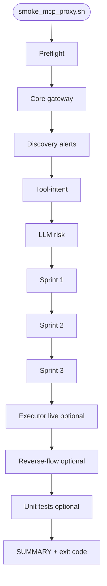

# MCP Security Proxy — Consolidated smoke test guide

This document is the full reference for **`tools/smoke_mcp_proxy.sh`**, the
one-command smoke suite that exercises **all currently implemented** MCP Security
Proxy capabilities in this repository: core gateway, Sprints 1–3 hardening, tool-intent,
LLM risk, discovery alerts, optional isolated-executor live integration, and optional
upstream Wazuh MCP reverse-flow tools.

Related docs:

| Topic | Document |
|--------|----------|
| Per-sprint E2E (no restart) | [MCP_PROXY_SPRINT_TESTING.md](MCP_PROXY_SPRINT_TESTING.md) |
| Implementation roadmap | [MCP_PROXY_ROADMAP.md](MCP_PROXY_ROADMAP.md) |
| Phase A1 executor deploy | [MCP_PROXY_PHASE_A1_DEPLOY.md](MCP_PROXY_PHASE_A1_DEPLOY.md) |
| Operations runbook | [OPERATIONS.md](OPERATIONS.md) |
| Product / commercialization | [ai-security-product-strategy.md](ai-security-product-strategy.md) |

---

## 1. Purpose and scope

### What this smoke suite is

- A **single orchestrator** that runs many existing integration scripts in a fixed order.
- A **regression gate** after proxy code changes, policy edits, or Profile C deploys.
- A **readiness check** before demos, release tagging, or CI promotion.

### What it is not

- Not a load or soak test (see sprint wrappers + burst scripts separately).
- Not a substitute for Playwright UI regression (`tools/smoke_phase4.sh` covers Phase 4 UI).
- Not an enterprise governance test (SSO, signed bundles, durable audit export are Sprint 4+).

### Features covered (mapping to repo capabilities)

| Product area | Smoke section | Underlying scripts / checks |
|--------------|---------------|-----------------------------|
| Core MCP gateway | Preflight, Core | `/health`, `/metrics`, `/mcp` ping, `/admin/policy-config` |
| Sprint 1 — trust | Sprint 1 wrapper | `test_trusted_servers.sh`, `test_descriptor_drift.sh`, `test_execution_tool_profile.sh` |
| Sprint 2 — containment | Sprint 2 wrapper | `test_sandbox_attestation.sh`, `test_dependency_fail_safe.sh` |
| Sprint 3 — isolated execution (policy) | Sprint 3 wrapper | `test_isolated_executor.sh`, `test_runtime_limits.sh`, `test_filesystem_restrictions.sh`, `test_upstream_provenance.sh` |
| Phase A1 — executor live | Executor live | `test_isolated_executor_live.sh` |
| Tool-intent verification | Tool-intent | `test_tool_intent_verification.sh`, `sanity_tool_intent_mismatch.sh`, `test_tool_intent_mismatch_misc.sh` |
| LLM risk enforcement | LLM risk | `smoke_llm_risk_enforcement.sh` |
| Discovery alerts | Discovery | `test_discovery_attack_pattern_denials.sh`, `test_discovery_write_tool_abuse.sh` |
| Upstream Wazuh MCP tools | Reverse-flow | `test_mcp_reverse_flow.sh` (direct `:3000/mcp`, not via proxy) |
| Unit tests (optional) | Unit tests | `pytest mcp-security-proxy/tests/test_app.py` |

### Overlap with Phase A and Phase B

`smoke_mcp_proxy.sh` is the **feature-regression** gate (Sprints 1–3, intent, LLM,
discovery, optional live executor). It does **not** replace Phase A operational sign-off
or Phase B commercialization tests.

| Area | `smoke_mcp_proxy.sh` | Phase A (`apply` / `test`) | Phase B (`test_mcp_proxy_phase_b.sh`) |
|------|----------------------|----------------------------|---------------------------------------|
| Sprint 1 — trust hardening | Yes (`test_sprint1_no_restart.sh`) | A5 stacks all sprints | No |
| Sprint 2 — containment / fail-safe | Yes | A5 | No |
| Sprint 3 — isolated execution (policy) | Yes | A5 | No |
| Phase A1 — live executor (`whoami`) | Optional (`--with-isolated-executor`) | A1 deploy + A5 live test | No |
| Phase A2 — policy / rollout samples | No | `apply_mcp_proxy_phase_a2.sh` | No |
| Phase A3 — staged enforcement | No | `apply_mcp_proxy_phase_a3.sh`, `test_mcp_proxy_phase_a3.sh` | No |
| Phase A4 — keys, ping, admin hygiene | No | `apply_mcp_proxy_phase_a4.sh`, `test_mcp_proxy_phase_a4.sh` | No |
| Phase A5 — full stacked regression | No (A5 can call smoke with `--with-smoke`) | `apply_mcp_proxy_phase_a5.sh` | No |
| Core presets (`core-*`) | No | No | Yes (`test_mcp_proxy_preset_core_strict.sh`) |
| Metering / tier gating | No* | No | Yes (`test_mcp_proxy_phase_b_metering.sh`) |
| Audit export + restart survival | No | No | Yes (`test_mcp_proxy_phase_b_audit.sh`) |
| Deploy UX (greenfield apply) | No | A1–A5 apply scripts | `apply_mcp_proxy_phase_b.sh` |

\*Optional `--with-unit-tests` runs `pytest` including commercial/metering unit tests in
`mcp-security-proxy/tests/test_app.py`; that is **not** the same as the Phase B E2E
metering and audit scripts.

**Partial Phase A overlap:** Smoke reuses the same sprint wrappers and
`test_isolated_executor_live.sh` that A5 runs, but smoke does **not** run A2/A3/A4 apply
flows, A3 staged-enforcement policy switches, or the full A5 stack in one shot.

**No Phase B overlap:** Presets, `/admin/usage`, `/admin/entitlements`, and
`/admin/audit-export` are only exercised by `tools/test_mcp_proxy_phase_b.sh` (and its
sub-scripts).

#### Recommended combined validation

```bash
# After proxy code or sprint-policy changes (feature regression, ~5–15 min)
bash tools/smoke_mcp_proxy.sh --with-isolated-executor

# After commercial preset, metering, or audit changes (~2–5 min)
bash tools/test_mcp_proxy_phase_b.sh

# Full Phase A sign-off (slowest; use before release or major policy rollout)
bash tools/apply_mcp_proxy_phase_a5.sh

# CI-style: smoke + unit tests + executor + reverse-flow
bash tools/smoke_mcp_proxy.sh --with-unit-tests --with-isolated-executor --with-reverse-flow
```

For day-to-day ops after Phase A and B are green:

```bash
bash tools/smoke_mcp_proxy.sh --with-isolated-executor && bash tools/test_mcp_proxy_phase_b.sh
```

See [MCP_PROXY_VERIFICATION_STATUS.md](MCP_PROXY_VERIFICATION_STATUS.md) for the master
testing matrix and last verified results.

---

## 2. Architecture and execution flow

The smoke runner does **not** reimplement tests inline. It:

1. Creates a temp directory for child script stdout/stderr.
2. Runs each child script with `bash`, capturing exit code and tail summary.
3. Records **PASS**, **FAIL**, or **SKIP** per named check.
4. Exits **non-zero** if any **FAIL** occurred (**SKIP** does not fail the run).



**Why discovery runs before sprints:** Sprint wrappers each **POST a sprint policy sample**
to `/admin/policy-config`. Discovery tests need **denied_tools**, **LLM risk enforce**,
and **discovery_rules** (including `write_tool_abuse`) in a predictable shape. Running
discovery first avoids sprint-3 policy side effects (for example relaxed LLM or executor
profiles) breaking deny-count assertions.

**Why sprints run after tool-intent / LLM risk:** Intent and LLM scripts temporarily
change `tool_intent` / `llm_risk` via SOC config endpoints; sprint wrappers then apply
full sprint baselines for trust/containment/execution gates.

---

## 3. Prerequisites

### 3.1 Host tools

| Tool | Required | Used for |
|------|----------|----------|
| `bash` | yes | Orchestrator and child scripts |
| `curl` | yes | HTTP checks |
| `jq` | yes | JSON assertions |
| `docker` | recommended | Key alignment, executor detection, Sprint 3 symbol check |
| `python3` + `.venv` | optional | `--with-unit-tests` only |

### 3.2 Running stack (Profile C)

Start the Phase 4 / MCP stack **before** smoke:

```bash
cd /path/to/Wazuh-MCP-Neo4j-OCTI-Mon-C-6
bash tools/start-profile.sh C
```

Verify containers:

```bash
docker ps --format 'table {{.Names}}\t{{.Status}}' \
  | grep -E 'mcp-security-proxy|wazuh-mcp-server'
curl -s http://localhost:8090/health | jq .
```

Expected proxy health:

```json
{
  "status": "healthy",
  "upstream": "http://wazuh-mcp-server:3000/mcp"
}
```

### 3.3 API keys (critical)

The proxy uses **two** credentials:

| Variable / secret | Direction | Purpose |
|-------------------|-----------|---------|
| `MCP_PROXY_API_KEY` | Client → proxy | `/mcp`, `/admin/*`, `/soc/*` on **:8090** |
| `MCP_PROXY_UPSTREAM_API_KEY` | Proxy → Wazuh MCP | Upstream `tools/list` / `tools/call` |

If they diverge, admin calls succeed but Sprint 1 **descriptor drift** fails with
`{"detail":"Invalid or expired token"}` on `tools/list`. The same 401 breaks Phase 4
**Fetch Alerts** (`POST /alerts/fetch`).

`MCP_API_KEY` in repo `.env` **must** be `wazuh_` + 43 URL-safe characters. The
placeholder `CHANGE_ME` is ignored by Wazuh MCP.

**Start (Profile C already passes repo `.env` into the proxy stack):**

```bash
bash tools/start-profile.sh C
```

**If upstream still 401s, align keys** (sets `MCP_PROXY_UPSTREAM_API_KEY` from
`wazuh-mcp-server`; keeps the existing `MCP_PROXY_API_KEY` client bearer so Phase 4
does not break):

```bash
bash tools/align_mcp_proxy_upstream_key.sh
```

**Verify:**

```bash
docker exec mcp-security-proxy printenv MCP_PROXY_UPSTREAM_API_KEY
docker exec wazuh-mcp-server printenv MCP_API_KEY
```

**Durable fix:** set a valid `wazuh_` `MCP_API_KEY` in repo `.env` **before**
`start-profile.sh C`. The wrapper passes that file into the proxy compose project
(which would otherwise not see repo-root `.env`) and copies the running Wazuh key
into `MCP_PROXY_UPSTREAM_API_KEY`.

Resolve proxy bearer for manual curls:

```bash
export MCP_PROXY_API_KEY="$(tools/mcp_api_key.sh --proxy)"
```

### 3.4 Optional components

| Component | When needed | How to enable |
|-----------|-------------|---------------|
| `isolated-executor` container | Phase A1 live check | `bash tools/start_isolated_executor.sh` |
| Phase 4 API `:8082` | Legacy SOC bridge only | Usually **not** required; smoke uses proxy `:8090` when Phase 4 returns HTTP 410 |
| Neo4j / OpenCTI | Full reverse-flow pass | Start OpenCTI profile or accept **SKIP** for Neo4j-unreachable |
| Model runner / LLM | LLM risk + attack-pattern discovery denies | Profile C model-runner; sprint-2 baseline enables `llm_risk.enforce` |

### 3.5 Python venv (unit tests only)

```bash
python3 -m venv .venv
source .venv/bin/activate
pip install -r mcp-security-proxy/requirements.txt pytest
```

---

## 4. Quick start

### Standard smoke (recommended)

```bash
bash tools/start-profile.sh C
bash tools/align_mcp_proxy_upstream_key.sh
bash tools/smoke_mcp_proxy.sh
```

### With isolated executor live test

```bash
bash tools/start-profile.sh C
bash tools/align_mcp_proxy_upstream_key.sh
bash tools/start_isolated_executor.sh
bash tools/smoke_mcp_proxy.sh --with-isolated-executor
```

### Fast path (skip sprint wrappers)

Use when you only changed tool-intent, discovery, or core proxy paths:

```bash
bash tools/smoke_mcp_proxy.sh --skip-sprints
```

### CI-friendly JSON summary

```bash
bash tools/smoke_mcp_proxy.sh --json
```

Example output:

```json
{
  "total": 15,
  "passed": 15,
  "failed": 0,
  "skipped": 2
}
```

---

## 5. Command-line reference

### 5.1 Invocation

```bash
bash tools/smoke_mcp_proxy.sh [options]
```

The script is also executable: `./tools/smoke_mcp_proxy.sh` (after `chmod +x`).

### 5.2 Options (complete)

| Option | Default | Description |
|--------|---------|-------------|
| `--proxy-base-url URL` | `http://localhost:8090` | MCP Security Proxy base URL |
| `--phase4-base-url URL` | `http://localhost:8082` | Phase 4 API base (used for SOC bridge probe only) |
| `--mcp-url URL` | `http://localhost:3000/mcp` | Direct upstream Wazuh MCP URL for reverse-flow |
| `--skip-sprints` | off | Skip `test_sprint{1,2,3}_no_restart.sh` |
| `--with-unit-tests` | off | Append full `pytest mcp-security-proxy/tests/test_app.py` |
| `--with-isolated-executor` | off | **Require** `test_isolated_executor_live.sh` (fail if container missing) |
| `--no-isolated-executor` | off | Never run executor live test |
| `--with-phase4-integration` | off | **Require** LLM risk + tool-intent sanity (fail if SOC unavailable) |
| `--no-phase4-integration` | off | Skip `smoke_llm_risk_enforcement.sh` and `sanity_tool_intent_mismatch.sh` |
| `--with-reverse-flow` | off | **Require** `test_mcp_reverse_flow.sh` |
| `--no-reverse-flow` | off | Never run reverse-flow |
| `--fail-fast` | off | Exit on first **FAIL** (default: run all checks, then summarize) |
| `--json` | off | Print JSON summary after human-readable `SUMMARY` |
| `-h`, `--help` | — | Show usage |

### 5.3 Environment variables

| Variable | Default | Used by |
|----------|---------|---------|
| `PROXY_BASE_URL` | `http://localhost:8090` | All proxy-facing checks |
| `PHASE4_BASE_URL` | `http://localhost:8082` | SOC bridge probe; child scripts when not redirected |
| `MCP_URL` | `http://localhost:3000/mcp` | Reverse-flow preflight and test |
| `MCP_PROXY_API_KEY` | resolved via `tools/mcp_api_key.sh --proxy` | Child scripts if exported |
| `MCP_API_KEY` | see `mcp_api_key.sh` | Reverse-flow (overridden with Wazuh container key) |

Child scripts may define additional variables (for example `ENFORCE_MODE` in
`test_tool_intent_verification.sh`); the smoke runner does not set those unless
documented in the child script.

### 5.4 Auto / on / off modes

Three suite groups use **auto** behavior by default:

| Group | Flag | Auto behavior | On | Off |
|-------|------|---------------|-----|-----|
| Isolated executor live | `ISOLATED_EXECUTOR_MODE` | Run if container `isolated-executor` exists | Require container | Skip |
| Phase 4 / SOC integration | `PHASE4_INTEGRATION_MODE` | Run if Phase 4 **or** proxy healthy | Require SOC | Skip LLM + sanity |
| Reverse-flow | `REVERSE_FLOW_MODE` | Run if upstream MCP ping succeeds | Require upstream | Skip |

---

## 6. Check catalog (every named result)

Each line printed as `PASS <name>`, `FAIL <name>: …`, or `SKIP <name>: …` corresponds
to one row below.

### 6.1 Preflight

| Check name | Pass criteria | On failure |
|------------|---------------|------------|
| `preflight.proxy_reachable` | `GET /health` → 200 and `status == "healthy"` | Start Profile C |
| `preflight.upstream_api_key` | `MCP_PROXY_UPSTREAM_API_KEY` == Wazuh `MCP_API_KEY` (when both containers exist) | `bash tools/align_mcp_proxy_upstream_key.sh` |

If proxy is unreachable and not `--fail-fast`, later sections may still run but will
likely fail; the runner prints an early exit hint when preflight fails and health stays down.

### 6.2 Core gateway

| Check name | Pass criteria |
|------------|---------------|
| `core.health` | Proxy healthy; logs `{status, upstream}` |
| `core.metrics` | `GET /metrics` 200 and body contains `mcp_security_proxy_` metrics |
| `core.mcp_ping` | `POST /mcp` JSON-RPC `ping` without `.error` |
| `core.admin_policy` | `GET /admin/policy-config` 200 with `raw_policy` or `policy` |

Prometheus metric families (examples): `mcp_security_proxy_calls_total`,
`mcp_security_proxy_denied_total`, `mcp_security_proxy_llm_risk_*`,
`mcp_security_proxy_tool_intent_*`, `mcp_security_proxy_discovery_triggers_total`.

### 6.3 Discovery alerts

**Preparation (inside smoke, before child scripts):**

1. Applies `config/phase4/mcp_proxy/policy.sample.sprint-2-containment-failsafe.json` via `/admin/policy-config`.
2. Ensures a `write_tool_abuse` discovery rule exists (`3 events in 5 minutes`, `monitor`).

| Check name | Child script | Validates |
|------------|--------------|-----------|
| `discovery.attack_pattern_denials` | `tools/test_discovery_attack_pattern_denials.sh` | Five risky `search_security_events` calls denied; `attack_pattern_denials` alert threshold |
| `discovery.write_tool_abuse` | `tools/test_discovery_write_tool_abuse.sh` | Three denied write tools (`wazuh_block_ip`, etc.); `write_tool_abuse` alert |

Both scripts snapshot/restore policy where applicable and clear discovery cooldown when configured.

### 6.4 Tool-intent verification

| Check name | Child script | Validates |
|------------|--------------|-----------|
| `tool_intent.verification` | `tools/test_tool_intent_verification.sh` | Safe intent call allowed; mismatch behavior per `ENFORCE_MODE` (default score-only) |
| `tool_intent.sanity_mismatch` | `tools/sanity_tool_intent_mismatch.sh` | Monitor → matched/mismatched traffic → observability → enforce → `/recent-denied` (SOC config via resolved base URL) |
| `tool_intent.misc_mismatch` | `tools/test_tool_intent_mismatch_misc.sh` | Missing/invalid intent metadata and contradictory pairings (proxy `/soc/*` paths) |

**SOC config base resolution:** If `GET ${PHASE4_BASE_URL}/soc/proxy-llm-risk-config` returns **410**
(Phase 4 wrapper retired), smoke redirects SOC calls to **`PROXY_BASE_URL`** (`:8090`).
Same logic applies to LLM risk.

### 6.5 LLM risk enforcement

| Check name | Child script | Validates |
|------------|--------------|-----------|
| `llm_risk.enforcement_smoke` | `tools/smoke_llm_risk_enforcement.sh` | Enable enforce via `/soc/proxy-llm-risk-config`; safe `tools/list`; malicious query denied; `/recent-denied`; observability metrics |

Uses **Bearer auth** when SOC base is the proxy. Child `proxy_rpc` intentionally omits
`curl --fail` so HTTP **403** responses with JSON-RPC `.error` still count as deny.

### 6.6 Sprint 1 — trust hardening

| Check name | Child script | Policy applied at start |
|------------|--------------|-------------------------|
| `sprint1.trust_hardening` | `tools/test_sprint1_no_restart.sh --skip-unit-tests` | `policy.sample.sprint-1-trust-hardening.json` |

Includes:

- `test_trusted_servers.sh` — `untrusted_server` deny + `untrusted_server_calls` discovery
- `test_descriptor_drift.sh` — descriptor hash drift + `descriptor_drift_events`
- `test_execution_tool_profile.sh` — `execution_tool_blocked` + `execution_tool_attempts`
- Upstream preflight ping + key alignment (via common helpers)

### 6.7 Sprint 2 — containment / fail-safe

| Check name | Child script | Policy applied at start |
|------------|--------------|-------------------------|
| `sprint2.containment_failsafe` | `tools/test_sprint2_no_restart.sh --skip-unit-tests` | `policy.sample.sprint-2-containment-failsafe.json` |

Includes:

- `test_sandbox_attestation.sh` — disables `execution_tool_profile` during test so attestation is evaluated first; expects `sandbox_attestation_missing`
- `test_dependency_fail_safe.sh` — dependency health + `prevent_silent_bypass`

### 6.8 Sprint 3 — isolated execution (policy gates)

| Check name | Child script | Policy applied at start |
|------------|--------------|-------------------------|
| `sprint3.isolated_execution` | `tools/test_sprint3_no_restart.sh --skip-unit-tests` | `policy.sample.sprint-3-isolated-execution.json` |

Includes:

- `test_isolated_executor.sh` — routing/deny without live executor
- `test_runtime_limits.sh`, `test_filesystem_restrictions.sh`, `test_upstream_provenance.sh`
- Docker symbol check for Sprint 3 functions in running `mcp-security-proxy` container

Does **not** require `isolated-executor` container (policy-only gates).

### 6.9 Phase A1 — isolated executor live

| Check name | Child script | When run |
|------------|--------------|----------|
| `executor.live_integration` | `tools/test_isolated_executor_live.sh` | Auto if `docker ps` shows `isolated-executor`; required with `--with-isolated-executor` |

Applies `policy.sample.sprint-3-executor-operational.json`, calls `shell_exec` / `whoami`,
expects executor evidence (`runtime_info`, `execution_id`). See
[MCP_PROXY_PHASE_A1_DEPLOY.md](MCP_PROXY_PHASE_A1_DEPLOY.md) for field-by-field output interpretation.

### 6.10 Upstream MCP reverse-flow

| Check name | Child script | Notes |
|------------|--------------|-------|
| `upstream.reverse_flow` | `tools/test_mcp_reverse_flow.sh` | Hits **`MCP_URL`** with **Wazuh** `MCP_API_KEY` (not proxy key) |

**Soft skip:** If the script reports passes but Neo4j is unreachable (`Connection refused`),
smoke records **SKIP** instead of **FAIL** (OpenCTI/Neo4j optional in minimal Profile C).

### 6.11 Unit tests (optional)

| Check name | Pass criteria |
|------------|---------------|
| `unit.mcp_security_proxy` | `pytest mcp-security-proxy/tests/test_app.py` exit 0 |

### 6.12 Skipped aggregate

| Check name | When |
|------------|------|
| `sprints.all` | `--skip-sprints` |

---

## 7. Exit codes and result semantics

| Exit code | Meaning |
|-----------|---------|
| `0` | All executed checks **PASS**; **SKIP** allowed |
| `1` | One or more **FAIL** checks |
| `2` | Usage error or missing required command (`bash`, `curl`, `jq`) |

| Result | Counted in `total`? | Fails run? |
|--------|---------------------|------------|
| **PASS** | yes (`passed`) | no |
| **FAIL** | yes (`failed`) | yes |
| **SKIP** | no (`skipped` only) | no |

Final line format:

```text
SUMMARY total=15 passed=15 failed=0 skipped=2
```

**Interpretation:** `total` is PASS + FAIL only. A healthy run may show `skipped=2` when
executor and Neo4j are absent in auto mode.

---

## 8. Policy and state side effects

Smoke **mutates live proxy policy** multiple times. Child scripts typically:

1. `GET /admin/policy-config` → snapshot `raw_policy`
2. `POST` test policy
3. Exercise `/mcp`
4. Restore on `EXIT` via `trap`

**Order of policy dominance at end of a full smoke run:** Sprint 3 sample is applied last
(by `test_sprint3_no_restart.sh`), so the proxy often ends on
`policy.sample.sprint-3-isolated-execution.json` unless a child restore succeeded.

To return to a known sample on disk:

```bash
bash tools/switch_mcp_policy_sample.sh sprint-2   # or sprint-1, sprint-3, sprint-3-executor
```

Discovery section applies sprint-2 **before** sprint wrappers; sprints overwrite afterward.

---

## 9. SOC / Phase 4 bridge behavior

Phase 4 may respond to legacy SOC paths with **HTTP 410** and a body pointing at the proxy:

```json
{
  "detail": "Phase4 wrapper retired for GET /soc/proxy-llm-risk-config. Call MCP security proxy directly.",
  "direct_url": "http://localhost:8090/soc/proxy-llm-risk-config"
}
```

Smoke probes `GET ${PHASE4_BASE_URL}/soc/proxy-llm-risk-config`:

| HTTP code | SOC base used for LLM risk + tool-intent sanity |
|-----------|--------------------------------------------------|
| `200` | `PHASE4_BASE_URL` (Phase 4 still proxies SOC) |
| `410`, `404` | `PROXY_BASE_URL` |
| other | Falls back to `PHASE4_BASE_URL` |

Proxy SOC endpoints (on **:8090**) include:

- `GET/POST /soc/proxy-llm-risk-config`
- `GET /soc/proxy-llm-risk-observability`
- `GET/POST /soc/proxy-tool-intent-config`
- `GET /soc/proxy-tool-intent-observability`
- `GET/POST /soc/proxy-policy-config` (used by misc tool-intent script)

---

## 10. Troubleshooting

| Symptom | Likely cause | Fix |
|---------|--------------|-----|
| `preflight.proxy_reachable` FAIL | Profile C not up | `bash tools/start-profile.sh C` |
| `preflight.upstream_api_key` FAIL | Upstream key mismatch | `bash tools/align_mcp_proxy_upstream_key.sh` |
| `core.mcp_ping` FAIL with `Invalid or expired token` | Wrong bearer for proxy | `export MCP_PROXY_API_KEY="$(tools/mcp_api_key.sh --proxy)"` |
| `sprint1` / descriptor drift FAIL with `.detail` token error | Same as upstream key | Align keys; ensure `trusted_servers` includes upstream (wrapper calls `mcp_test_ensure_trusted_upstream_policy`) |
| `discovery.attack_pattern_denials` FAIL — calls not denied | LLM risk off or model runner down | Use sprint-2 baseline (smoke applies it); check model-runner |
| `discovery.write_tool_abuse` FAIL — no alert | Missing discovery rule | Smoke upserts rule; ensure denies occurred (denied_tools in policy) |
| `llm_risk.enforcement_smoke` FAIL curl 401 | SOC on proxy without auth | Fixed in `smoke_llm_risk_enforcement.sh` (Bearer to proxy) |
| `llm_risk.enforcement_smoke` FAIL curl 22 on deny step | `curl --fail` on HTTP 403 | Child script must not use `--fail` on deny RPC (fixed) |
| `sprint3` FAIL missing symbols | Stale proxy image | Rebuild `mcp-security-proxy` container (see [MCP_PROXY_SPRINT_TESTING.md](MCP_PROXY_SPRINT_TESTING.md)) |
| `executor.live_integration` FAIL | Container not running | `bash tools/start_isolated_executor.sh` |
| `upstream.reverse_flow` SKIP | Neo4j down | Start OpenCTI stack or accept skip |
| `sandbox_attestation` got `execution_tool_blocked` | Profile precedence | Sprint 2 test disables `execution_tool_profile` during attestation test |

### Capturing child script logs

Failed checks summarize the **last 5 lines** of child output. For full logs, re-run the
child script directly:

```bash
bash tools/test_sprint1_no_restart.sh --skip-unit-tests 2>&1 | tee /tmp/sprint1.log
```

Temp files from the orchestrator live under `/tmp/smoke-mcp-proxy.*` until exit.

---

## 11. CI and automation examples

### GitHub Actions (illustrative)

```yaml
- name: MCP proxy smoke
  run: |
    bash tools/start-profile.sh C
    bash tools/align_mcp_proxy_upstream_key.sh
    bash tools/smoke_mcp_proxy.sh --json --no-isolated-executor
```

### Post-deploy hook

```bash
#!/bin/bash
set -euo pipefail
cd /opt/wazuh-mcp-neo4j
bash tools/smoke_mcp_proxy.sh --fail-fast --skip-sprints
```

### Nightly full regression

```bash
bash tools/smoke_mcp_proxy.sh --with-unit-tests --with-isolated-executor --with-reverse-flow
```

---

## 12. Relationship to other test entrypoints

| Entrypoint | Use when |
|------------|----------|
| `tools/smoke_mcp_proxy.sh` | Feature regression (Sprints 1–3, intent, LLM, discovery); **not** Phase B |
| `tools/test_mcp_proxy_phase_b.sh` | Core presets, metering, audit export (Phase B only) |
| `tools/apply_mcp_proxy_phase_a5.sh` | Full Phase A stacked regression (slowest sign-off) |
| `tools/test_mcp_proxy_phase_a3.sh` | A3 staged enforcement only |
| `tools/test_mcp_proxy_phase_a4.sh` | Keys, ping, admin API hygiene only |
| `tools/test_sprintN_no_restart.sh` | Debugging a single sprint only |
| `tools/test_*` (individual gates) | Minimal reproduction of one deny reason |
| `tools/smoke_llm_risk_enforcement.sh` | LLM risk only |
| `tools/sanity_tool_intent_mismatch.sh` | Tool-intent E2E only |
| `tools/smoke_phase4.sh` | Phase 4 API + UI Playwright (not MCP proxy core) |
| `tools/test_isolated_executor_live.sh` | Phase A1 executor only |
| `tools/deploy_isolated_executor_a1.sh` | Deploy + short executor smoke |

---

## 13. Extending the smoke suite

When adding a new proxy feature:

1. Add or extend an integration script under `tools/test_*.sh` with snapshot/restore policy discipline.
2. Add a `run_*_suite` section or `run_bash_script` call in `tools/smoke_mcp_proxy.sh`.
3. Document the new check name in **section 6** of this file.
4. Update [MCP_PROXY_ROADMAP.md](MCP_PROXY_ROADMAP.md) if the feature changes shipped status.

Prefer **auto/on/off** for optional external dependencies (databases, executor sidecars).

---

## 14. Example successful output (annotated)

```text
== MCP SECURITY PROXY — CONSOLIDATED SMOKE ==

== PREFLIGHT ==
proxy:  http://localhost:8090
phase4: http://localhost:8082
mcp:    http://localhost:3000/mcp
PASS preflight.proxy_reachable
PASS preflight.upstream_api_key

== CORE GATEWAY ==
PASS core.health
PASS core.metrics
PASS core.mcp_ping
PASS core.admin_policy

== DISCOVERY ALERTS ==
INFO discovery baseline policy applied (sprint-2 sample)
INFO ensured write_tool_abuse discovery rule
PASS discovery.attack_pattern_denials
PASS discovery.write_tool_abuse

== TOOL-INTENT VERIFICATION ==
PASS tool_intent.verification
PASS tool_intent.sanity_mismatch
PASS tool_intent.misc_mismatch

== LLM RISK ENFORCEMENT ==
PASS llm_risk.enforcement_smoke

== SPRINT 1 — TRUST HARDENING ==
PASS sprint1.trust_hardening

== SPRINT 2 — CONTAINMENT / FAIL-SAFE ==
PASS sprint2.containment_failsafe

== SPRINT 3 — ISOLATED EXECUTION (POLICY GATES) ==
PASS sprint3.isolated_execution

== PHASE A1 — ISOLATED EXECUTOR LIVE ==
SKIP executor.live_integration: container not running (auto)

== UPSTREAM MCP REVERSE-FLOW ==
SKIP upstream.reverse_flow: optional Neo4j/OpenCTI dependency unavailable

SUMMARY total=15 passed=15 failed=0 skipped=2
```

Two skips are normal for a minimal Profile C without executor and Neo4j.

---

## 15. File reference

| Path | Role |
|------|------|
| [tools/smoke_mcp_proxy.sh](../tools/smoke_mcp_proxy.sh) | Orchestrator |
| [tools/mcp_proxy_test_common.sh](../tools/mcp_proxy_test_common.sh) | Shared auth, policy apply, upstream preflight |
| [tools/mcp_api_key.sh](../tools/mcp_api_key.sh) | Resolve `--proxy` vs Wazuh keys |
| [tools/align_mcp_proxy_upstream_key.sh](../tools/align_mcp_proxy_upstream_key.sh) | Recreate proxy with Wazuh upstream key |
| [config/phase4/mcp_proxy/policy.sample.*.json](../config/phase4/mcp_proxy/) | Sprint and executor policy samples |
