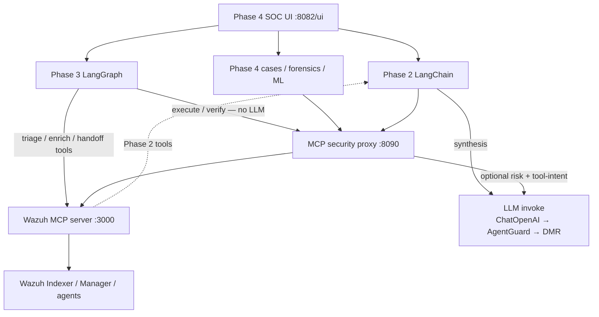
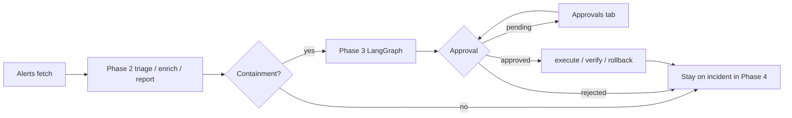
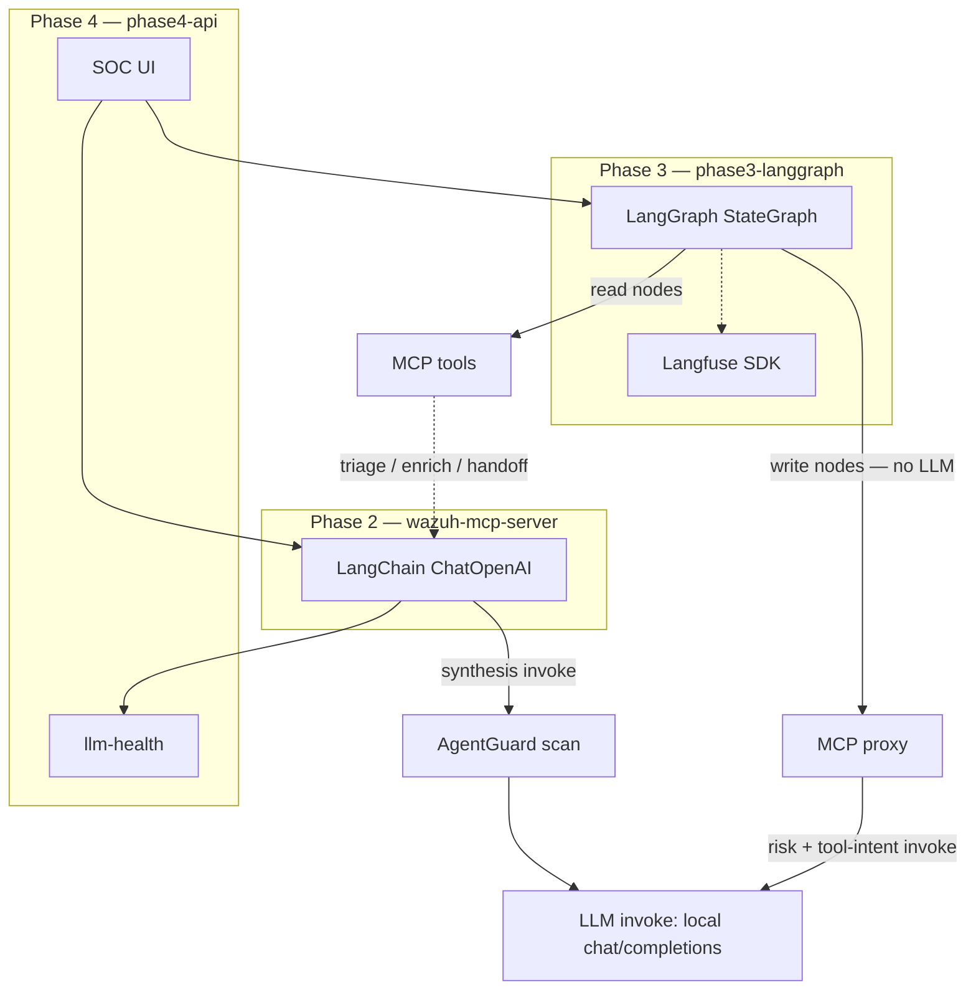
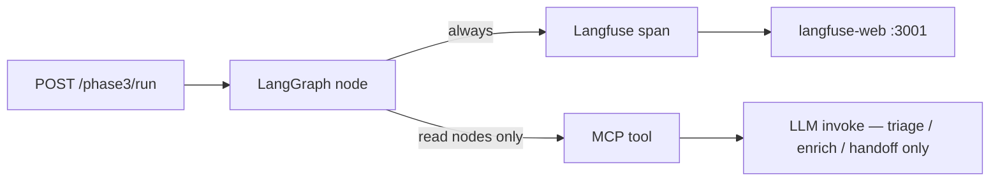
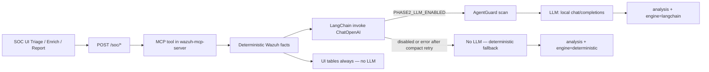
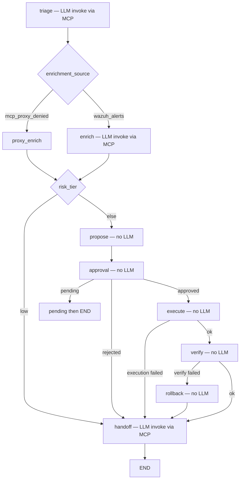
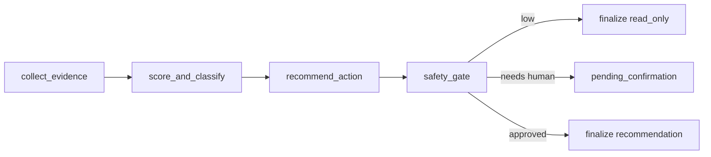
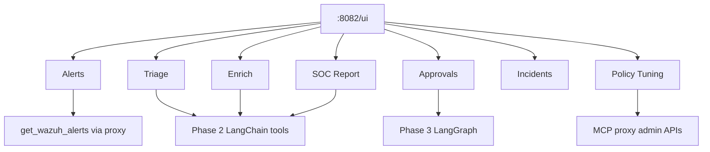

# SOC Governance — Functionality and Architecture

**Read this first.** This is the leading document for the repository.

The product is three stacked SOC capabilities on top of a forked Wazuh MCP
server and an MCP security proxy:

| Phase | Job | Write to the estate? | Where you use it |
|---|---|---|---|
| **Phase 2** | Read-only triage, enrichment, shift handoff | No | SOC UI Triage / Enrich / SOC Report; MCP tools |
| **Phase 3** | Propose → human approve → execute → verify → rollback | Yes, after approval | SOC UI Approvals; `POST /phase3/run` |
| **Phase 4** | Incidents, SLA, playbooks, forensics, ML, the SOC UI that hosts the other two | Orchestrates 2 and 3 | `http://localhost:8082/ui` |

Operational bring-up: [OPERATIONS.md](OPERATIONS.md#first-run-local-stack).
GitHub front door: [README.md](../README.md).

Last reviewed against this tree (Wazuh MCP fork v4.2.1 plus Phases 2–4).

---

## 1. What this product is

Language models can already **query a SIEM and fire active responses** through
MCP. This repository adds **governance and SOC operations**:

- **Phase 2** — understand the alert without changing anything
- **Phase 3** — change the estate only after a human gate
- **Phase 4** — run the case: ticket, evidence, forensics, metrics, UI

It is **not** a from-scratch SIEM. Collection stays Wazuh. The MCP tool surface
is a fork of [gensecaihq/Wazuh-MCP-Server](https://github.com/gensecaihq/Wazuh-MCP-Server)
v4.2.1. Phase 2–4, the proxy, isolated executor, AgentGuard, and compose
profiles are original work by Serguei Fedotov.

Sister product: [rag-protection](https://github.com/marifort/rag-protection)
governs what an AI may **read**. This repo governs what an AI may **do**.



---

## 2. How the three phases chain

A typical investigation:

1. **Phase 4 Alerts** loads live detections (`POST /alerts/fetch` →
   `get_wazuh_alerts`). Optionally promote a row to an incident
   (`POST /alerts/to-incident`) or bulk-ingest (`POST /alerts/wazuh/ingest`).
2. **Phase 2 Triage / Enrich / SOC Report** summarize and correlate — still
   read-only. Tables are computed in Python; an optional local LLM writes the
   narrative card.
3. **Phase 3** is invoked when the analyst wants containment (`block_ip`,
   `isolate_host`, or `quarantine_file`). The graph pauses on **Approvals**
   unless `auto_approve` is set. After resume it executes, verifies, and can
   roll back.
4. **Phase 4** keeps the ticket, SLA, evidence, Neo4j/OpenCTI correlation,
   playbooks, and proxy policy-tuning in one UI.

Guarantee: Phase 2 never calls write tools. Phase 3 is the only path that
intends to. The MCP proxy can still **deny** those writes even after approval
if policy says so.



---

## 3. LangChain, LangGraph, and Langfuse

Public, short versions of the diagrams below (for the GitHub front door):
[README.md — LLM frameworks in the SOC path](../README.md#llm-frameworks-in-the-soc-path).

These three libraries are **not stacked in the same process**. They map to
phases:

| Library | Phase | Role | Default in Profile C |
|---|---|---|---|
| **LangChain** | **2** (and proxy risk/intent) | Prompt → local model → parser for *narratives* and optional MITRE/IOC JSON | Off (`PHASE2_LLM_ENABLED=false`) |
| **LangGraph** | **3** | `StateGraph` for write workflow, incident grouping, and investigation playbooks | On (`phase3-langgraph`) |
| **Langfuse** | **3** tracing only | Root trace + per-node spans for `/phase3/run` | Off (`LANGFUSE_ENABLED=false`; overlay not in `start-profile.sh`) |

Phase 3 **does not import LangChain**. `node_propose_action` is a `use_case`
lookup, not an LLM. When Phase 3 calls `triage_wazuh_alerts` /
`enrich_wazuh_context` / `generate_soc_handoff_report`, those tools may use
LangChain **inside** `wazuh-mcp-server` if Phase 2 LLM is enabled. Langfuse
then records the Phase 3 *graph node*, not the LangChain chain.

Phase 4 has no LangChain or LangGraph runtime of its own. The SOC UI calls
Phase 2 MCP tools and proxies Phase 3 graphs. It *does* watch LangChain
success vs fallback on IOC pivot (`GET /soc/llm-health`, `/soc/llm-divergence`).

The MCP proxy can also use LangChain (`provider: langchain` in policy) for
**LLM-risk** and **tool-intent** scores on every `tools/call`. That is
governance, not Phase 2 synthesis.



### Enable LangChain (Phase 2)

In `.env` (then recreate `wazuh-mcp-server`):

```env
PHASE2_LLM_ENABLED=true
PHASE2_LLM_MODEL=ai/qwen3
PHASE2_LLM_BASE_URL=http://agentguard:8088/v1/proxy/openai/v1
PHASE2_LLM_API_KEY=not-needed
PHASE2_LLM_TIMEOUT_SECONDS=45
```

Confirm: Triage tab or `POST /soc/triage` → `data.orchestration.engine` is
`langchain`. `deterministic` means the flag is off, deps missing, or the
model rejected the payload (compact retries happen first).

Verifier: `bash tools/verify_phase2_langchain.sh`.
Guide: [LANGCHAIN_PHASE2_GUIDE.md](LANGCHAIN_PHASE2_GUIDE.md).

### Enable LangGraph (Phase 3)

Already running under Profile C as `phase3-langgraph` (`:8081`). Three compiled
graphs in `services/phase3_langgraph/`:

| Graph | File | HTTP | Writes? |
|---|---|---|---|
| Guarded write `workflow` | `app/main.py` `build_workflow()` | `POST /phase3/run` | Yes, after approval |
| Incident grouping | `app/main.py` `build_grouping_workflow()` | `/phase3/incident-grouping/*` | No |
| Investigation playbooks | `app/playbooks.py` `build_playbook_workflow()` | `/phase3/playbooks/*` | **No** — recommend only; run `/phase3/run` to execute |

Guide: [LANGGRAPH_PHASE3_GUIDE.md](LANGGRAPH_PHASE3_GUIDE.md).

### Enable Langfuse (Phase 3 traces)

Not started by `tools/start-profile.sh C`. Add the overlay and keys:

```bash
export LANGFUSE_ENABLED=true
export LANGFUSE_PUBLIC_KEY=pk-local-smoke
export LANGFUSE_SECRET_KEY=sk-local-smoke
export LANGFUSE_HOST=http://langfuse-web:3000

docker compose \
  -f compose.full.yml \
  -f compose.phase3.langgraph.yml \
  -f compose.phase4.yml \
  -f compose.langfuse.oss.yml \
  up -d --build phase3-langgraph langfuse-web langfuse-worker
```

UI: `http://localhost:3001` (see [OPERATIONS.md](OPERATIONS.md) Langfuse ports).
Each `/phase3/run` response includes `outputs.trace.trace_id` when ingestion
worked. Smoke: `bash tools/smoke_phase3_enhancements.sh` (set
`LANGFUSE_ASSERT_TRACE=true` to require a backend trace).

Langfuse does **not** replace approval state, Wazuh execution, or Phase 2
LangChain logging.



---

## 4. Phase 2 — read-only analyst synthesis

**Guarantee:** no active response, no host mutation. If the LLM is down, the
same structured payload is still returned with a deterministic summary.

**Code:** `src/wazuh_mcp_server/phase2.py`, dispatched from
`mcp/tool_handlers/phase2.py`, registered in `mcp/handlers/tools.py`.
SOC UI wraps the same tools via `POST /soc/triage`, `/soc/enrich`, `/soc/report`
in `phase4/server.py`.

**Guide:** [LANGCHAIN_PHASE2_GUIDE.md](LANGCHAIN_PHASE2_GUIDE.md).

### Tools and UI tabs

| MCP tool | SOC UI tab | Objective | Deterministic facts | Optional LLM card |
|---|---|---|---|---|
| `triage_wazuh_alerts` | **Triage** | Prioritize recent alerts | Severity breakdown, top rules/agents/IPs, agent health, sample alerts | Analyst summary + read-only next steps |
| `enrich_wazuh_context` | **Enrich** | Pivot on query / rule / agent / src IP | Matching alerts, patterns, top threats, optional agent CVEs | Narrative tying alerts to that pivot |
| `generate_soc_handoff_report` | **SOC Report** | Shift handoff | Cluster health, agents, alert-by-level, top threats, manager errors, critical CVEs | Posture narrative |

Related read tools used beside these three: `map_alerts_to_mitre_attack`
(heuristics in `_MITRE_HEURISTICS` plus optional LangChain classify),
`ioc_pivot`, and proxy-policy recommendation helpers.

### LLM path vs fallback

When `PHASE2_LLM_ENABLED=true`, synthesis goes through LangChain to an
OpenAI-compatible endpoint (typically AgentGuard
`http://agentguard:8088/v1/proxy/openai/v1` → Docker Model Runner).

Response always includes:

- structured `data.*` (tables the UI renders regardless of LLM)
- `data.analysis` — narrative
- `data.orchestration.engine` — `langchain` or `deterministic`
- `data.orchestration.status` / model / base_url when LangChain ran

Payloads are sanitized (`_REDACT_KEYS`), size-capped (`_LLM_PAYLOAD_MAX_BYTES`),
and retried compact if the model context is too small. That is why a large
Triage window can succeed on retry or fall back to deterministic mode — not a
silent drop of the tool.

Phase 2 **does not** handle MCP transport, auth, or Wazuh API safety; those
stay in `server.py` / `auth.py` / `api/wazuh_client.py`.



---

## 5. Phase 3 — human-gated write workflow

**Guarantee:** write tools run only after the approval gate (or explicit
`auto_approve` for labs). Action choice is **request-driven** (`use_case`),
not “the LLM picked isolate.” Triage/enrich nodes still run for context and
audit; `node_propose_action` maps `use_case` → tool plan.

**Code:** `services/phase3_langgraph/app/main.py`, `playbooks.py`.
Compose: `compose.phase3.langgraph.yml` (`phase3-langgraph` on `:8081`).

**Guide:** [LANGGRAPH_PHASE3_GUIDE.md](LANGGRAPH_PHASE3_GUIDE.md).

### Use cases (execute / verify / rollback triples)

From `_build_action_plan()`:

| `use_case` | Execute | Verify | Rollback |
|---|---|---|---|
| `block_ip` | `wazuh_firewall_drop` | `wazuh_check_blocked_ip` | `wazuh_firewall_allow` |
| `isolate_host` | `wazuh_isolate_host` | `wazuh_check_agent_isolation` | `wazuh_unisolate_host` |
| `quarantine_file` | `wazuh_quarantine_file` | `wazuh_check_file_quarantine` | `wazuh_restore_file` |

`GET /use-cases` documents risk-tier behaviour: low stays read-only; medium
leans block-IP with one approval; high isolate + verify + rollback; critical
quarantine with strict approval.

### Graph nodes (standard run)

1. `node_triage` / `node_enrichment` / `node_proxy_enrichment` — read context
2. `node_propose_action` — fill `proposed_action` from `use_case`
3. `node_approval_gate` — if `approval_required` and not `auto_approve`, set
   `workflow_status=pending_approval` and wait
4. Analyst **Approvals** tab (Phase 4) or
   `POST /phase3/approvals/{incident_id}/resume`
5. `node_execute_action` — MCP write
6. `node_verify_action` — MCP check; on failure `node_rollback_action`
7. `node_handoff`



Also implemented: incident-grouping graph (`/phase3/incident-grouping/*`),
structlog audit (`audit_logging.py`), Tenacity retries on MCP calls, optional
Langfuse traces (`compose.langfuse.oss.yml`).

### How Phase 4 hosts Phase 3

- `POST /phase3/proxy` — run the graph from the SOC UI
- `POST /approvals` / `.../decide` / `.../cancel` — human gate in the UI
- `GET|POST /phase3/playbooks/*` and grouping pending/resume

Sample proxy policy still **denies** destructive tools until an operator
relaxes it. Approval in Phase 3 does not bypass proxy policy.

Investigation playbooks (`brute_force`, `beaconing`, `malware`,
`privilege_escalation`, `exfiltration`) are a **second** LangGraph. They collect
evidence, score, recommend, and safety-gate. They **never execute** writes;
the analyst must still call `/phase3/run` with the returned `proposed_action`.



---

## 6. Phase 4 — case operations, forensics, ML, SOC UI

**Guarantee:** this is the operator console. It does not replace Phases 2 or 3;
it **hosts** them, persists incidents, and adds forensics/ML/analytics.

**Code:** `src/wazuh_mcp_server/phase4/server.py` (`create_app()`), UI
`phase4/static/index.html` at `http://localhost:8082/ui`.
Compose: `compose.phase4.yml`.

**Guides:** [PHASE4_IMPLEMENTATION.md](PHASE4_IMPLEMENTATION.md),
[PHASE4_SMOKE_TEST_AND_USER_GUIDE.md](PHASE4_SMOKE_TEST_AND_USER_GUIDE.md).

### SOC UI views (what the analyst clicks)

| View | Phase it exercises | Backend |
|---|---|---|
| **Alerts** | 4 (fetch) | `POST /alerts/fetch` → MCP `get_wazuh_alerts` |
| **Triage** | **2** | `POST /soc/triage` |
| **Enrich** | **2** | `POST /soc/enrich` |
| **SOC Report** | **2** | `POST /soc/report` |
| **Approvals** | **3** | `/approvals`, Phase 3 resume |
| **Incidents** | **4** | `/incidents` CRUD, assign, resolve, evidence |
| **Policy Tuning** | 4 + proxy | `/soc/proxy-*` denied-call analysis and recommendations |

Phase 4 LangChain/LangGraph/Langfuse usage:

- **LangChain:** none in-process. Triage / Enrich / Report / MITRE / IOC pivot
  reuse Phase 2 tools; watch `GET /soc/llm-health` and `/soc/llm-divergence`.
- **LangGraph:** none in-process. Approvals and `POST /phase3/proxy` call
  `phase3-langgraph`.
- **Langfuse:** none. Traces stay on the Phase 3 service.



### Incident and SLA

`phase4/incident_management/api.py` — create/list/update, assign, resolve,
escalate, close, archive, activities, evidence. SLA policies under
`/sla-policies`. Postgres is the system of record.

### Playbooks (Phase 4 orchestration)

`phase4/orchestration/playbooks.py` — `POST /playbooks/{name}/execute`.

Shipped examples:

- `RANSOMWARE_RESPONSE_PLAYBOOK` — isolate → firewall drop → disable user →
  verify isolation → notify → create incident
- `BRUTE_FORCE_RESPONSE_PLAYBOOK` — block/mitigate brute-force pattern

These steps call the same MCP write/verify tools Phase 3 uses; proxy policy
still applies.

### Forensics and threat intel

`phase4/forensics/` — Neo4j graph (`neo4j_attack_chain`,
`neo4j_lateral_movement`, `neo4j_ip_context`, `neo4j_query`), STIX mapping,
OpenCTI client/sync (`opencti_*` MCP tools), MinIO evidence blobs.

### Analytics and ML

- Analytics: `/analytics/sla-metrics`, risk-distribution, workload, MTTD/MTTR,
  trends, top-rules, false-positive-rate (`phase4/analytics/`)
- ML: `/ml/status`, `/ml/train`, `/ml/train/upload`, `/ml/infer`, `/ml/artifacts`
  (`phase4/ml/` — XGBoost, MLflow)

### Supporting Phase 4 processes

Postgres, Neo4j, Redis, RabbitMQ, Celery, Prefect, MinIO, Prometheus, Grafana,
MLflow (`compose.phase4.yml`). OpenCTI is the Profile C overlay
(`compose.opencti.yml`).

---

## 7. Supporting runtime (proxy, MCP, SIEM)

Phases 2–4 all call tools through this path. Alerts fetch never talks to the
Wazuh Manager API directly.

| Hop | Process | Source | Port |
|---|---|---|---|
| SOC UI / REST | `phase4-api` | `phase4/server.py` | `:8082` |
| MCP gateway | `mcp-security-proxy` | `mcp-security-proxy/mcp_security_proxy/app.py` | `:8090` |
| Isolated exec (optional) | `isolated-executor` | `mcp-isolated-executor/isolated_executor/app.py` | `:18088` host |
| Tool backend | `wazuh-mcp-server` | `server.py` + `mcp/handlers/tools.py` | `:3000` |
| Phase 3 graph | `phase3-langgraph` | `services/phase3_langgraph/` | `:8081` |
| LLM firewall | `agentguard` | `agentic-ai-firewall/agentguard/` | `:8088` |
| SIEM | Wazuh manager / indexer / dashboard | `compose.full.yml` | `:55000` / `:8443` |
| Chat | Open WebUI | `compose.full.yml` | `:3100` |

**Proxy** (`POST /mcp`): method allowlist, denied tools (sample policy blocks
destructive writes), argument patterns, LLM-risk and tool-intent scores,
optional isolated-executor routing, audit. Operate UI: `:8090/ui`.

**MCP server:** Streamable HTTP, bearer/`wazuh_` API keys. Write tools listed
in `WRITE_SCOPE_TOOLS` (`tools.py`) need `wazuh:write`. Full catalog:
[api/README.md](api/README.md).

Two bearers:

- `MCP_API_KEY` — proxy → Wazuh (`wazuh_<43-char>` required)
- `MCP_PROXY_API_KEY` — Phase 4 / UI → proxy (default
  `mcp_proxy_local_demo_change_me`)

---

## 8. Source map

| Path | Owns |
|---|---|
| `src/wazuh_mcp_server/phase2.py` | **Phase 2** synthesis, MITRE heuristics, LLM contract |
| `src/wazuh_mcp_server/mcp/tool_handlers/phase2.py` | **Phase 2** MCP dispatch |
| `services/phase3_langgraph/app/main.py` | **Phase 3** graph, approval, execute/verify/rollback |
| `services/phase3_langgraph/app/playbooks.py` | **Phase 3** use-case → action mapping |
| `src/wazuh_mcp_server/phase4/server.py` | **Phase 4** app: SOC routes, alerts, approvals, Phase 3 proxy |
| `src/wazuh_mcp_server/phase4/static/index.html` | **Phase 4** SOC UI |
| `src/wazuh_mcp_server/phase4/incident_management/` | Incidents / SLA |
| `src/wazuh_mcp_server/phase4/orchestration/playbooks.py` | Ransomware / brute-force playbooks |
| `src/wazuh_mcp_server/phase4/forensics/` | Neo4j, OpenCTI, STIX, MinIO |
| `src/wazuh_mcp_server/phase4/ml/` | XGBoost / MLflow |
| `src/wazuh_mcp_server/server.py` | MCP HTTP `/mcp` |
| `src/wazuh_mcp_server/mcp/handlers/tools.py` | Tool catalog |
| `mcp-security-proxy/` | Policy gateway |
| `agentic-ai-firewall/` | Phase 2 LLM firewall |
| `tools/start-profile.sh` | Profiles A–D |

---

## 9. Documentation map

| Doc | Use when |
|---|---|
| [LANGCHAIN_PHASE2_GUIDE.md](LANGCHAIN_PHASE2_GUIDE.md) | **Phase 2 LangChain** — enable, payloads, verifier |
| [LANGGRAPH_PHASE3_GUIDE.md](LANGGRAPH_PHASE3_GUIDE.md) | **Phase 3 LangGraph** + **Langfuse** traces |
| [PHASE4_IMPLEMENTATION.md](PHASE4_IMPLEMENTATION.md) | **Phase 4** layers |
| [PHASE4_SMOKE_TEST_AND_USER_GUIDE.md](PHASE4_SMOKE_TEST_AND_USER_GUIDE.md) | **Phase 4** incidents, ingest, smoke |
| [OPERATIONS.md](OPERATIONS.md) | First-run keys, ports |
| [TROUBLESHOOTING.md](TROUBLESHOOTING.md) | Alerts 401, Phase 2 context limits |
| [api/README.md](api/README.md) | Every MCP tool |
| [WAZUH_MCP_FORK.md](WAZUH_MCP_FORK.md) | Inherited SIEM MCP README |
| [mcp-security-proxy/README.md](../mcp-security-proxy/README.md) | Proxy controls |
| [OPENCTI_INTEGRATION.md](OPENCTI_INTEGRATION.md) | STIX / OpenCTI |
| [PHASE3_4_ARCHITECTURE_DECISIONS.md](PHASE3_4_ARCHITECTURE_DECISIONS.md) | Why propose_action stays request-driven |

---

## 10. In-scope vs adjacent

**Implemented here:** Phase 2 read-only synthesis, Phase 3 human-gated writes,
Phase 4 case/forensics/ML UI, MCP proxy, local Wazuh compose, AgentGuard,
isolated-executor demo sidecar.

**Adjacent:** commercial proxy SKUs
([MCP_PROXY_COMMERCIAL_PACKAGING.md](MCP_PROXY_COMMERCIAL_PACKAGING.md));
[rag-protection](https://github.com/marifort/rag-protection) (read-side RAG); production gVisor-class isolation (the sidecar
is an allow-listed demo).

**Not this product:** replacing Wazuh, or a multi-tenant SaaS SOC. This is a
**governed agentic SIEM lab** for one workstation, with Phase 2 / 3 / 4 as the
operator-facing product.
