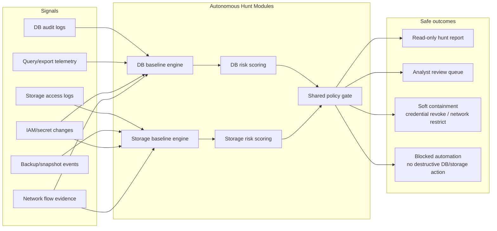

# Reference Architecture

← [Back to index](../AUTONOMOUS_THREAT_HUNTING_LOCAL_LLM.md)

---

## 4. Reference Architecture

```
      |
      v
Phase 3 LangGraph Hunt Workflow
  1) Plan Hunt (LLM, local)
  2) Execute Evidence Queries (deterministic tool calls)
  3) Correlate & Score (deterministic first, optional LLM synthesis)
  4) Decision Gate (policy)
      |
      +--> MCP tools (wazuh-mcp-server)
      |      - search_security_events
      |      - ioc_pivot
      |      - map_alerts_to_mitre_attack
      |      - opencti_query_indicators
      |      - neo4j_attack_chain / neo4j_ip_context
      |
      +--> Phase 4 observability metrics and logs
```

## 4.1 Should This Be Built Autonomously in Rust + Docker MCP Toolkit?

Short answer: yes, this is a strong option if your top priorities are safety
isolation, independent release velocity, and runtime efficiency.

### Why it makes sense
- Strong fault isolation from existing Phase 2-4 services
- Lower blast radius for autonomous logic regressions
- Rust memory safety and predictable performance for long-running automation
- Language-agnostic MCP boundary via Docker MCP toolkit
- Independent deploy/rollback lifecycle for autonomous hunting capability

### Trade-offs to accept

- Additional build and CI/CD complexity (polyglot stack)
- Contract-management overhead between Rust service and Python services
- Potential duplication if logic is split without strict ownership boundaries
- Rust-side ecosystem for rapid LLM experimentation is narrower than Python

### Recommended decision policy

Use decoupled Rust architecture when one or more are true:

- you plan to enable higher autonomy tiers (including quarantine)
- you need strong runtime SLOs under sustained hunt workloads

Use in-process extension of current Python path when one or more are true:

- you are still iterating rapidly on hunt prompt/tool design
- you want minimum short-term delivery complexity
- autonomy remains read-only for the near term

Recommended practical path: keep Phase 2-4 unchanged, add autonomous hunting as
a separate Rust service now, and preserve a fallback mode where analyst actions
remain in current Phase 3/4 paths.

## 4.2 Detailed Separated Architecture (Target State)

This architecture explicitly separates autonomous threat hunting from currently
implemented Phase 2-4 functionality while reusing existing data and control

```mermaid
flowchart LR
    subgraph CurrentStack[Current Implemented Stack (Unchanged Phase 2-4)]
        P2[Phase 2 SOC retrieval/synthesis\nPython]
        P4[Phase 4 API + LLM monitoring\nPython/FastAPI]
        MCP[wazuh-mcp-server tools surface]
        OBS[Prometheus + Grafana + logs]
    end

    subgraph AutoStack[New Autonomous Hunting Stack (Separated)]
        SCH[Scheduler/Event Trigger]
        ORCH[Hunt Orchestrator FSM\nRust]
        PLAN[Planning Engine\nLocal LLM via Docker Model Runner]
        POL[Policy Engine\nDeterministic gates + JSON validation]
        EVID[Evidence Collector\nAllowlisted MCP/REST adapters]
      DBH[Database Hunt Module\nprivilege/export/schema hunts]
      STH[Storage Hunt Module\nmass access/delete/policy drift hunts]
        SCORE[Correlation & Scoring\nDeterministic first, LLM optional]
        QUAR[Containment Adapter\nQuarantine/rollback wrappers]
        STORE[(Hunt State Store\nrun snapshots + audit trail)]
    end

    SCH --> HAPI --> ORCH
    ORCH --> POL
    ORCH --> EVID
    ORCH --> DBH
    ORCH --> STH
    EVID --> SCORE --> DECIDE
    STH --> SCORE
    DECIDE -->|read-only report| STORE
    EVID --> MCP
    EVID --> P4
    P4 --> OBS
    HAPI --> OBS
    ORCH --> STORE
    POL --> STORE
    QUAR --> STORE

    classDef current fill:#eef6ff,stroke:#2563eb,color:#0f172a;
    classDef auto fill:#ecfdf5,stroke:#059669,color:#052e16;
    classDef data fill:#fff7ed,stroke:#c2410c,color:#431407;
    class P2,P3,P4,MCP,OBS current;
    class SCH,HAPI,ORCH,PLAN,POL,EVID,DBH,STH,SCORE,DECIDE,QUAR auto;
    class STORE data;
```

  In this target state, database and storage threat hunting are explicit
  autonomous modules with their own signals, baselines, and scoring paths, while
  still feeding the same policy-gated decision controller.

### Implementation-oriented variant (ports, APIs, metrics, call contracts)

```mermaid
flowchart TB
    subgraph Ext[External Triggers]
        CRON[Cron/Scheduler]
        EVT[Event Trigger]
    end

    subgraph AH[autonomous-hunt-rust]
        API[Hunt API :8091]
        FSM[Orchestrator FSM]
      DBMOD[Database Hunt Workers]
      STMOD[Storage Hunt Workers]
        POL2[Policy + Schema Validator]
        EMIT[Metrics Exporter /metrics]
    end

    subgraph P3S[phase3-langgraph :8081]
        P3API[Playbook API]
    end

    subgraph P4S[phase4-api :8082]
        P4API[SOC + LLM Safety API]
        P4MET[/metrics]
    end

    subgraph MCPS[wazuh-mcp-server]
        MCPHTTP[HTTP MCP bridge :8080]
    end

    subgraph OBS2[Observability]
        PROM[Prometheus :9090]
        GRAF[Grafana :3000]
    end

    CRON -->|POST /v1/hunts/run| API
    EVT -->|POST /v1/hunts/run| API
    API --> FSM --> POL2
    FSM --> DBMOD
    FSM --> STMOD

    FSM -->|POST /soc/enrich| P4API
    FSM -->|POST /soc/ioc-pivot| P4API
    FSM -->|POST /soc/mitre-map| P4API

    FSM -->|POST / (JSON-RPC method tools/call)| MCPHTTP
    MCPHTTP -->|tool=triage_wazuh_alerts| FSM
    MCPHTTP -->|tool=enrich_wazuh_context| FSM
    MCPHTTP -->|tool=search_security_events| FSM
    MCPHTTP -->|tool=ioc_pivot| FSM
    MCPHTTP -->|tool=map_alerts_to_mitre_attack| FSM
    MCPHTTP -->|future: query_database_audit_events| DBMOD
    MCPHTTP -->|future: query_storage_access_events| STMOD
    MCPHTTP -->|future: inspect_backup_integrity| STMOD

    FSM -->|POST /phase3/playbooks/run| P3API
    FSM -->|GET /metrics| P4MET

    API -->|GET /metrics| EMIT
    EMIT --> PROM
    P4MET --> PROM
    PROM --> GRAF
```

Reference implementation ports (recommended):

- autonomous-hunt-rust: 8091
- phase3-langgraph: 8081
- phase4-api: 8082
- wazuh-mcp-server bridge: 8080
- prometheus: 9090
- grafana: 3000

Route status legend used below:

- Existing: route is implemented in current codebase
- Proposed: route is part of autonomous-hunt-rust contract and not yet implemented in this repo

Endpoint alignment (repo-verified):

| Surface | Route in this design | Status | Repo-verified implemented route |
|---|---|---|---|
| Autonomous hunt API | `POST /v1/hunts/run` | Proposed | n/a (new service contract) |
| Autonomous hunt API | `GET /v1/hunts/{run_id}` | Proposed | n/a (new service contract) |
| Autonomous hunt API | `GET /v1/hunts/latest` | Proposed | n/a (new service contract) |
| Phase 4 SOC | `POST /soc/ioc-pivot` | Existing | `POST /soc/ioc-pivot` |
| Phase 4 SOC | `POST /soc/mitre-map` | Existing | `POST /soc/mitre-map` |
| Phase 4 SOC | `POST /soc/enrich` | Existing | `POST /soc/enrich` |
| Phase 3 playbooks | `POST /phase3/playbooks/run` | Existing | `POST /phase3/playbooks/run` |
| MCP bridge | `POST /` with JSON-RPC `method=tools/call` | Existing | `POST /` JSON-RPC transport |
| MCP bridge | `POST /tools/call` | Proposed alias | n/a (not used by current Phase 3 code) |

Contract versioning and migration policy:

- v1 (current interoperability baseline)
  - MCP transport uses JSON-RPC over `POST /` with `method="tools/call"`
  - Phase 3 playbook trigger uses `POST /phase3/playbooks/run`
  - Phase 4 SOC routes use current names (`/soc/ioc-pivot`, `/soc/mitre-map`, `/soc/enrich`)

- v2 (autonomous API stabilization target)
  - Keep all v1 routes working without behavior changes
  - Add optional REST alias for MCP tool invocation (`POST /tools/call`) in front of JSON-RPC adapter
  - Introduce explicit autonomous API namespace (`/v1/hunts/*`) as implementation contract for Rust service

- Compatibility guarantees
  - Backward compatibility window: minimum two minor releases after any new alias is introduced
  - No silent semantic changes to existing fields (additive changes only)
  - Every response includes `contracts_version` for autonomous-hunt endpoints
  - Deprecated routes must emit warning logs and deprecation headers before removal

- Migration gates before any breaking change
  - integration tests pass for both old and new route forms
  - dashboard and alert queries validated against unchanged metric names
  - approval and rollback flows validated end-to-end in staging

Contract change log:

| Date | Release | Surface | Change type | Summary | Backward compatible | Notes |
|---|---|---|---|---|---|---|
| 2026-05-09 | 0.1.0-doc | MCP transport | Documented baseline | Confirmed JSON-RPC over `POST /` with `method=tools/call` as v1 contract | Yes | Matches current Phase 3 `_mcp_call` path |
| 2026-05-09 | 0.1.0-doc | Phase 3 playbooks | Route alignment | Standardized docs to `POST /phase3/playbooks/run` | Yes | Replaced prior proposed `/execute` wording |
| 2026-05-09 | 0.1.0-doc | Phase 4 SOC | Route alignment | Standardized docs to `POST /soc/mitre-map`, `POST /soc/enrich`, `POST /soc/ioc-pivot` | Yes | Matches implemented Phase 4 server routes |
| 2026-05-09 | 0.2.0-proposed | Autonomous hunt API | New surface | Proposed `POST /v1/hunts/run`, `GET /v1/hunts/{run_id}`, `GET /v1/hunts/latest` | Yes | New service contract for autonomous-hunt-rust |
| 2026-05-09 | 0.2.0-proposed | MCP REST alias | New alias | Proposed optional `POST /tools/call` alias in front of JSON-RPC adapter | Yes | Keep v1 JSON-RPC path active for compatibility |

Update policy for this table:

- Add one row per contract-affecting route, field, or metric change.
- Never edit historical rows in-place; add a superseding row with a new date and release.
- If compatibility is broken, include migration deadline and required client changes in Notes.

Exact API contracts for autonomous hunting service:

1. Start hunt (Proposed)

- Endpoint: POST /v1/hunts/run
- Request:

```json
{
  "mode": "adversarial_test",
  "scenario": "sqli",
  "time_window_min": 60,
  "max_tool_calls": 20,
  "max_records_per_call": 500,
  "allow_write_actions": false,
  "correlation_id": "hunt-2026-05-09-0001"
}
```

- Response:

```json
{
  "run_id": "01J8Y7P2A0A5Q7K9S2C8H6M4RP",
  "status": "accepted",
  "started_at": "2026-05-09T15:31:22Z",
  "contracts_version": "1.0"
}
```

2. Hunt status (Proposed)

- Endpoint: GET /v1/hunts/{run_id}
- Response:

```json
{
  "run_id": "01J8Y7P2A0A5Q7K9S2C8H6M4RP",
  "status": "completed",
  "mode": "adversarial_test",
  "scenario": "sqli",
  "requested_action_tier": "tier1",
  "score": 0.82,
  "confidence": 0.78,
  "policy_trace": [
    "read_only_mode=true",
    "write_actions_blocked=true",
    "llm_safety_ok=true"
  ],
  "evidence_refs": [
    "evt:search_security_events:sha256:...",
    "evt:ioc_pivot:sha256:..."
  ],
  "finished_at": "2026-05-09T15:32:05Z"
}
```

3. Latest report shortcut (Proposed)

- Endpoint: GET /v1/hunts/latest
- Response: same schema as GET /v1/hunts/{run_id}

Exact downstream call contracts (autonomous-hunt-rust to current services):

1. Phase 4 IOC pivot (Existing)

- Endpoint: POST http://phase4-api:8082/soc/ioc-pivot
- Request:

```json
{
  "ioc_value": "203.0.113.10",
  "include_llm": true,
  "timeframe": "24h"
}
```

- Required response fields:

```json
{
  "data": {
    "verdict": "suspicious",
    "deterministic_baseline": {
      "verdict": "suspicious"
    }
  }
}
```

2. MCP tool call (Existing JSON-RPC transport)

- Endpoint: POST http://wazuh-mcp-server:3000/
- Request:

```json
{
  "jsonrpc": "2.0",
  "id": "autonomous-search-security-events",
  "method": "tools/call",
  "params": {
    "name": "search_security_events",
    "arguments": {
      "query": "src_ip:203.0.113.10",
      "limit": 200
    }
  }
}
```

- Required response fields:

```json
{
  "result": {
    "content": [
      {
        "type": "json",
        "json": {
          "events": []
        }
      }
    ],
    "isError": false
  }
}
```

3. Phase 3 playbook escalation (Existing)

- Endpoint: POST http://phase3-langgraph:8081/phase3/playbooks/run
- Request:

```json
{
  "incident_id": "INC-2026-0001",
  "playbook": "brute_force",
  "time_range": "24h",
  "evidence": {
    "agent_id": "001",
    "src_ip": "203.0.113.10"
  }
}
```

Metrics to expose for implementation-level observability:

- autonomous_hunt_runs_total{mode,scenario,status}
- autonomous_hunt_run_duration_seconds{mode,scenario}
- autonomous_hunt_tool_calls_total{tool,status}
- autonomous_hunt_tool_call_duration_seconds{tool}
- autonomous_hunt_policy_blocks_total{reason}
- autonomous_hunt_action_requests_total{tier,action}
- autonomous_hunt_quarantine_attempts_total{result}
- autonomous_hunt_llm_tokens_total{direction}

Existing Phase 4 safety metrics to consume as guardrail inputs:

- phase4_llm_fallback_rate_pct
- phase4_llm_divergence_rate_pct
- phase4_llm_injection_suspect_total

Recommended future DB/storage-specific metrics for the autonomous service:

- autonomous_hunt_database_admin_anomalies_total{action,result}
- autonomous_hunt_database_export_anomalies_total{db_name}
- autonomous_hunt_storage_mass_access_anomalies_total{storage_class}
- autonomous_hunt_storage_policy_drift_total{resource_type}
- autonomous_hunt_backup_integrity_failures_total{backup_type}

### Focused DB/storage hunt flow



Interpretation of this flow:

- DB and storage hunts maintain separate baselines because normal behavior,
  risk, and rollback characteristics differ materially.
- Both domains feed a shared policy gate so autonomy tiers stay consistent with
  the rest of the platform.
- Safe automation for these domains should prefer soft containment only:
  credential revocation, token disablement, narrow network restriction, or
  temporary access suspension.
- Destructive or hard-to-reverse actions remain blocked by default for
  databases, backups, snapshots, and primary storage resources.

### Functional separation model

- Current stack (Phase 2-4): existing SOC APIs, existing playbooks, existing
  monitoring, existing MCP tooling
- Autonomous stack (new Rust): hunt lifecycle, planning, orchestration,
  confidence scoring pipeline, autonomy tier control, quarantine wrappers,
  audit packaging for autonomous runs

### Integration contracts (hard boundaries)

1. Evidence contract

- Autonomous stack can read from Phase 2/4 and MCP allowlisted tool surfaces

- Autonomous decisions output strict structured payload:
  - hypothesis
  - evidence_refs
  - policy_trace

3. Action contract

- Tier 0: no write actions allowed
- Tier 1: write actions only through human approval path in existing workflow
  verify + rollback-ready semantics
4. Observability contract

- Autonomous stack emits its own metrics namespace and run ids
- Existing Phase 4 metrics remain unchanged and continue as global safety input

The new autonomous stack should include all of the following capabilities,

1. Triggering

- Scheduled hunts
- Event-driven hunts from anomaly conditions
- IOC/watchlist-triggered hunts

2. Hunt planning

- Local LLM plan generation under strict schema
- Prompt hardening and injection-resistant instruction templates

3. Deterministic evidence execution

- Allowlisted query execution
- Budget enforcement (time/calls/records)
- Retry/backoff and partial-result handling

4. Correlation and scoring

- Deterministic baseline score computation
- Optional LLM narrative synthesis
- Confidence calibration with divergence checks

- Analyst approval path integration

6. Containment and rollback

- Quarantine wrapper API
- Verification checks after action
- Rollback-ready requirement for every destructive action path

7. Adversarial simulation mode

- SQL injection-like telemetry replay tests
- MCP abuse boundary tests
- Guardrail validation under hostile-like inputs

8. Safety circuit-breakers

- Coupling to fallback/divergence/injection metrics
- Automatic downgrade from Tier 2 to Tier 1 on safety threshold breach

9. Audit and compliance

- Immutable run log for detect/decide/act/verify
- Reproducible evidence references
- Policy trace for every high-impact decision

### Deployment topology (minimal)

- `autonomous-hunt-rust` container (new)
- existing `wazuh-mcp-server` container (unchanged)
- existing Phase 3/4 containers (unchanged)
- shared observability backplane (Prometheus/Grafana)

This topology preserves current functionality while allowing the autonomous
hunting subsystem to scale, fail, and release independently.

