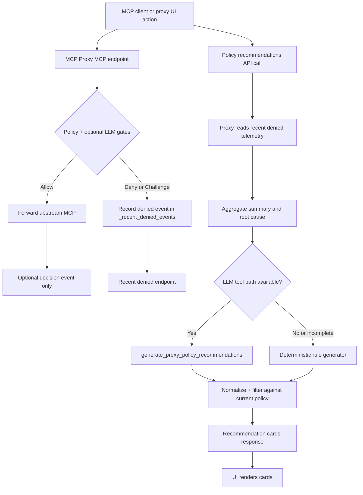
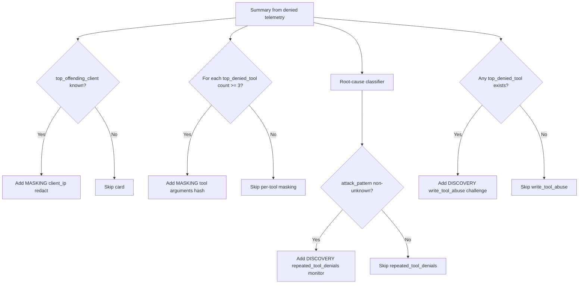

# Policy Tuning Recommendation Assistant API

← [Back to Feature Catalog](08-llm-feature-catalog-and-promql.md)

## Endpoint: `POST /soc/proxy-policy-recommendations`

**Purpose:** Generate LLM-based policy tuning recommendations from observed proxy telemetry. Analyzes recent allowed and denied calls to recommend updates to masking rules and discovery rules for reducing false positives and improving coverage.

**Safety Model:** Recommendations only (no auto-apply). Human review is required for all suggestions.

---

## Request

### URL
```
POST http://mcp-security-proxy:8090/soc/proxy-policy-recommendations
```

### Headers
```
Content-Type: application/json
```

### Body

```json
{
  "time_range": "24h",
  "limit": 100,
  "focus": "all",
  "run_llm": true,
  "recommendation_types": ["masking", "discovery"]
}
```

### Parameters

| Parameter | Type | Default | Valid Values | Description |
|-----------|------|---------|--------------|-------------|
| `time_range` | string | `"24h"` | Any valid duration (e.g., "1h", "7d") | Time window for analyzing recent proxy events |
| `limit` | int | `100` | 10–500 | Maximum number of events to include in analysis |
| `focus` | string | `"all"` | `all`, `overblocking`, `underblocking` | Focus area: all types, false positives, or false negatives |
| `run_llm` | bool | `true` | `true`, `false` | Attempt LLM-backed recommendation generation before falling back to heuristic logic |
| `recommendation_types` | array | `["masking", "discovery"]` | `["masking"]`, `["discovery"]`, or both | Types of policy recommendations to generate |

---

## Response

### Success (200 OK)

```json
{
  "status": "ok",
  "summary": {
    "time_range": "24h",
    "focus": "overblocking",
    "total_denied": 47,
    "deny_reasons": {
      "rate_limit": 23,
      "rbac_violation": 15,
      "argument_validation": 9
    },
    "top_denied_tools": {
      "write_alert": 12,
      "bulk_operation": 9,
      "read_event": 7
    },
    "top_offending_client": "192.168.65.1"
  },
  "llm": {
    "invoked": true,
    "engine": "policy-deterministic",
    "fallback_used": false,
    "report_summary": "Generated policy tuning review from recent proxy denials"
  },
  "recommendations": [
    {
      "type": "masking",
      "target": "client_ip",
      "action": "redact",
      "rationale": "Top offending client 192.168.65.1 appears in 47 denied calls; recommend masking client_ip in audit logs",
      "confidence": 0.7,
      "tool_scope": ["write_alert", "bulk_operation", "read_event"],
      "mode": "redact",
      "impact": "low — logs only, no functionality change"
    },
    {
      "type": "masking",
      "target": "tool_arguments[write_alert]",
      "action": "hash",
      "rationale": "Tool 'write_alert' has 12 denials; recommend hashing sensitive arguments for forensic correlation",
      "confidence": 0.6,
      "tool_scope": ["write_alert"],
      "mode": "hash",
      "impact": "low — enables correlation without exposing values"
    },
    {
      "type": "discovery",
      "signal": "repeated_tool_denials",
      "action": "monitor",
      "rationale": "Detected repeated denials; recommend discovery rule to flag probing campaigns",
      "confidence": 0.65,
      "threshold": "5 denials in 5 minutes",
      "action_on_trigger": "monitor",
      "impact": "medium — may flag aggressive security testing"
    }
  ],
  "human_review_required": true,
  "safety_model": "recommendations_only_no_auto_apply",
  "next_steps": [
    "Review each recommendation rationale and confidence score",
    "Validate recommendation against known SOC use cases",
    "Test recommendation in staging/lab with trace monitoring",
    "Apply only after team consensus and change control approval"
  ]
}
```

### Error Response (Bad Request)

```json
{
  "status": "error",
  "detail": "Request body must be a JSON object"
}
```

---

## Response Fields

### Top-Level Fields

| Field | Type | Description |
|-------|------|-------------|
| `status` | string | Always `"ok"` on success |
| `summary` | object | Aggregated analysis of proxy deny/allow patterns |
| `llm` | object | Indicates whether the LLM-backed path was invoked and whether fallback logic was used |
| `recommendations` | array | List of suggested policy updates |
| `human_review_required` | bool | Always `true`; indicates manual review is mandatory |
| `safety_model` | string | Always `"recommendations_only_no_auto_apply"` |
| `next_steps` | array | Recommended actions for acting on recommendations |

### LLM Object

| Field | Type | Description |
|-------|------|-------------|
| `invoked` | bool | `true` when the endpoint successfully called the LLM-backed MCP report path |
| `engine` | string | Recommendation engine used, typically `langchain` or `deterministic` |
| `fallback_used` | bool | `true` when the endpoint had to fall back from the LLM path |
| `report_summary` | string | Short analysis summary from the LLM report when available |
| `detail` | string | Fallback error detail when the LLM invocation fails |

### Summary Object

| Field | Type | Description |
|-------|------|-------------|
| `time_range` | string | The requested time window (e.g., "24h") |
| `focus` | string | Applied focus mode echoed by the API (`all`, `overblocking`, `underblocking`) |
| `total_denied` | int | Total denied calls in the window |
| `deny_reasons` | object | Frequency map of denial reasons |
| `top_denied_tools` | object | Frequency map of tools with highest deny count |
| `top_offending_client` | string | Client IP with most denials |

### Recommendation Object

| Field | Type | Description |
|-------|------|-------------|
| `type` | string | `"masking"` or `"discovery"` |
| `target` | string | What policy field to update |
| `action` | string | For masking: `redact`, `hash`, `tokenize`; for discovery: `monitor`, `challenge`, `quarantine` |
| `rationale` | string | Human-readable justification for the recommendation |
| `confidence` | float | 0.0–1.0 confidence score |
| `tool_scope` | array | Which tools this recommendation applies to |
| `impact` | string | Expected impact on SOC operations |
| `threshold` | string | (discovery only) Detection threshold |
| `action_on_trigger` | string | (discovery only) Action when rule triggers |

---

## Examples

### Example 1: Get all recommendations

```bash
curl -sS -X POST http://localhost:8090/soc/proxy-policy-recommendations \
  -H 'Content-Type: application/json' \
  -d '{
    "time_range": "24h",
    "limit": 100,
    "focus": "all",
    "recommendation_types": ["masking", "discovery"]
  }' | jq '.'
```

### Example 2: Focus on overblocking (false positives)

```bash
curl -sS -X POST http://localhost:8090/soc/proxy-policy-recommendations \
  -H 'Content-Type: application/json' \
  -d '{
    "time_range": "7d",
    "limit": 200,
    "focus": "overblocking",
    "recommendation_types": ["masking"]
  }' | jq '.recommendations[] | {type, target, confidence, rationale}'
```

### Example 3: Discovery rules only

```bash
curl -sS -X POST http://localhost:8090/soc/proxy-policy-recommendations \
  -H 'Content-Type: application/json' \
  -d '{
    "time_range": "48h",
    "limit": 150,
    "focus": "all",
    "recommendation_types": ["discovery"]
  }' | jq '.recommendations[] | {signal, threshold, action_on_trigger, confidence}'
```

### Example 4: Recent short window for rapid iteration

```bash
curl -sS -X POST http://localhost:8090/soc/proxy-policy-recommendations \
  -H 'Content-Type: application/json' \
  -d '{
    "time_range": "1h",
    "limit": 50,
    "focus": "all",
    "recommendation_types": ["masking"]
  }' | jq '{status, total_recommendations: (.recommendations | length), safety_model}'
```

---

## Workflow Integration

### Step 1: Fetch Recommendations

Call the endpoint with your desired time window and focus area.

### Step 2: Review Confidence and Impact

- **Confidence ≥ 0.7**: High confidence; prioritize for review
- **Confidence 0.5–0.69**: Moderate confidence; validate against known patterns
- **Confidence < 0.5**: Low confidence; consider for future analysis only

- **Impact "low"**: Safe to test/pilot in staging
- **Impact "medium"**: May affect legitimate use cases; coordinate with SOC team
- **Impact "high"**: Careful planning required; involve security leadership

### Step 3: Test in Staging

Apply recommendations to your lab/staging environment with trace monitoring enabled.

### Step 4: Validate Against Use Cases

- Do recommended masking rules break legitimate correlation workflows?
- Do recommended discovery rules trigger false positives on known-good behaviors?
- Are any sensitive fields still exposed after suggested masking?

### Step 5: Apply via Change Control

After validation, apply recommendations via your standard change control process (e.g., pull request to policy.json, peer review, deployment).

### Step 6: Monitor Acceptance Metrics

Track:
- `policy_recommendations_generated_total` — total recommendations
- `policy_recommendations_applied_total` — accepted and deployed
- `policy_recommendations_rejected_total` — dismissed during review
- `policy_rule_false_positive_rate` — to catch unintended side effects

---

## Known Limitations

1. **Deterministic fallback:** If LLM is unavailable, endpoint returns deterministic recommendations based on telemetry patterns alone.

2. **No auto-apply:** Recommendations are for human review only. Policy changes must be applied manually.

3. **Sensitive to recent events:** Recommendations are biased toward recent patterns; longer time windows smooth anomalies.

4. **Limited context:** Recommendations are based on proxy telemetry only; business context and historical policy decisions are not included.

5. **Security proxy filtering:** If the MCP security proxy blocks a policy-tool call due to prompt-injection patterns, the endpoint returns deterministic fallback recommendations and includes the proxy reason in `llm.detail`.

---

## Current Implementation Notes

1. **Dedicated policy MCP tool:** `POST /soc/proxy-policy-recommendations` uses `generate_proxy_policy_recommendations` (policy-scoped) instead of generic SOC handoff recommendations.

2. **Focus-aware behavior:** Discovery recommendation actions differ by focus:
  - `overblocking` tends toward monitor-first recommendations.
  - `underblocking` tends toward challenge-oriented recommendations.

3. **Response echo:** The API now echoes applied `focus` under `summary.focus` for downstream UI and automation consumers.

4. **Engine provenance:** `llm.engine` is expected to be `policy-deterministic` when the dedicated tool path is used successfully.

### Data Flow for Recommendation Cards

This section describes the end-to-end path that produces recommendation cards in the standalone proxy service.

1. Any MCP client issues an MCP JSON-RPC tool call directly to MCP proxy (`http://mcp-security-proxy:8090/mcp`).
2. MCP proxy evaluates policy (`allowed_methods`, `denied_tools`, `blocked_argument_patterns`, optional LLM risk and tool-intent gates).
3. If denied/challenged, proxy records an event in `_recent_denied_events` with `timestamp`, `request_id`, `method`, `tool`, `reason`, `client_ip`, and argument summary.
4. When `POST /soc/proxy-policy-recommendations` is requested on `:8090`, the proxy reads `/recent-denied` data from in-memory telemetry.
5. Proxy aggregates denied events into summary statistics:
  - `total_denied`
  - `deny_reasons`
  - `top_denied_tools`
  - `top_offending_client`
6. Proxy computes root-cause context (`attack_pattern`, `recommended_policy_action`) from deny reason mix and optional labels.
7. Proxy builds recommendation cards from summary and root-cause (LLM tool path first, deterministic fallback when needed).
8. Cards are returned to UI; user accept/reject actions can be applied through proxy policy endpoints.

Important scope note:
- Card generation uses proxy denied-call telemetry, not historical Wazuh alert documents.
- The telemetry buffer is in-memory in proxy and is reset on proxy restart/rebuild.

#### Activity Diagram: End-to-End Recommendation Flow



#### Activity Diagram: Card Rule Evaluation



#### Data Objects Used in Generation

1. Proxy denied event object (source):
  - `timestamp`, `request_id`, `method`, `tool`, `reason`, `client_ip`, `arguments_summary`, optional `metadata`
2. Recommendation summary object (derived):
  - `total_denied`, `deny_reasons`, `top_denied_tools`, `top_offending_client`
3. Root-cause object (derived):
  - `attack_pattern`, `false_positive_candidate`, `recommended_policy_action`
4. Recommendation card object (output):
  - Masking cards: `type`, `target`, `action`, `rationale`, `confidence`, `tool_scope`, `impact`
  - Discovery cards: `type`, `signal`, `action`, `rationale`, `confidence`, `threshold`, `action_on_trigger`, `tool_scope`, `impact`

### Recommendation Card Generation Rules

The following cards are generated from aggregated denied-call telemetry (`/recent-denied`) and root-cause analysis in mcp-security-proxy.

1. **MASKING: `client_ip`**
  - Trigger: `summary.top_offending_client` is present and not `unknown`/empty.
  - Source fields: `top_offending_client`, `total_denied`, `top_denied_tools`.
  - Output behavior: emits `type=masking`, `target=client_ip`, `action=redact`, and includes up to the top 3 tools in `tool_scope`.

2. **MASKING: `tool_arguments[<tool>]` (example: `tool_arguments[search_security_events]`)**
  - Trigger: tool appears in `summary.top_denied_tools` with deny count >= 3.
  - Source fields: `top_denied_tools` frequency map.
  - Output behavior: emits one masking card per qualifying tool with `action=hash` and tool-local `tool_scope`.

3. **DISCOVERY: `repeated_tool_denials`**
  - Trigger: root-cause classifier derives a non-unknown `attack_pattern`.
  - Source signals for `attack_pattern`:
    - `llm_risk_deny` / `llm_risk_challenge` (or dominant LLM label)
    - `blocked_pattern*`
    - `tool_denied`
    - `method_not_allowed`
  - Output behavior: emits `type=discovery`, `signal=repeated_tool_denials`, `action=monitor`, threshold `5 denials in 5 minutes`.

4. **DISCOVERY: `write_tool_abuse`**
  - Trigger: at least one entry exists in `summary.top_denied_tools`.
  - Source fields: top entry from `top_denied_tools` (highest deny volume).
  - Output behavior: emits `type=discovery`, `signal=write_tool_abuse`, `action=challenge`, scoped to the dominant denied tool.

Implementation references:
- Policy recommendation endpoint and builder: `mcp-security-proxy/mcp_security_proxy/app.py` (`soc_proxy_policy_recommendations`, `_policy_tuning_recommendations_fallback`, `_llm_policy_tuning_recommendations`)
- Denied telemetry aggregation and root-cause classifier: `mcp-security-proxy/mcp_security_proxy/app.py` (`_summarize_proxy_denied`, `_proxy_denied_root_cause`)
- Proxy denied event model and recorder: `mcp-security-proxy/mcp_security_proxy/app.py` (`_record_denied_event`)

### How to Validate Each Rule (curl + jq)

Set API key once:

```bash
export MCP_PROXY_API_KEY="${MCP_PROXY_API_KEY:-mcp_proxy_local_demo_change_me}"
```

1. Validate **MASKING: `client_ip`** inputs (`top_offending_client`, `total_denied`)

```bash
curl -sS -H "Authorization: Bearer ${MCP_PROXY_API_KEY}" \
  'http://localhost:8090/recent-denied?limit=200' | jq '
  .events // []
  | {total_denied: length,
     top_offending_client: (group_by(.client_ip) | map({client_ip: .[0].client_ip, n: length}) | sort_by(-.n) | .[0].client_ip),
     by_client: (group_by(.client_ip) | map({client_ip: .[0].client_ip, n: length}) | sort_by(-.n)[:5])}
'
```

2. Validate **MASKING: `tool_arguments[search_security_events]`** trigger (`count >= 3`)

```bash
curl -sS -H "Authorization: Bearer ${MCP_PROXY_API_KEY}" \
  'http://localhost:8090/recent-denied?limit=200' | jq '
  .events // []
  | map(select(.tool == "search_security_events"))
  | {tool: "search_security_events", deny_count: length,
     qualifies_for_masking_hash: (length >= 3),
     by_reason: (group_by(.reason) | map({reason: .[0].reason, n: length}) | sort_by(-.n))}
'
```

3. Validate **DISCOVERY: `repeated_tool_denials`** root-cause signal candidates

```bash
curl -sS -H "Authorization: Bearer ${MCP_PROXY_API_KEY}" \
  'http://localhost:8090/recent-denied?limit=200' | jq '
  .events // []
  | {reason_counts: (group_by(.reason) | map({reason: .[0].reason, n: length}) | sort_by(-.n)),
     attack_pattern_inputs: {
       blocked_pattern: ([.[] | select((.reason // "") | startswith("blocked_pattern"))] | length),
       tool_denied: ([.[] | select(.reason == "tool_denied")] | length),
       method_not_allowed: ([.[] | select(.reason == "method_not_allowed")] | length),
       llm_risk_signals: ([.[] | select((.reason // "") | startswith("llm_risk_"))] | length),
       llm_intent_signals: ([.[] | select((.reason // "") | startswith("llm_intent_"))] | length)
     }}
'
```

4. Validate **DISCOVERY: `write_tool_abuse`** dominant denied tool

```bash
curl -sS -H "Authorization: Bearer ${MCP_PROXY_API_KEY}" \
  'http://localhost:8090/recent-denied?limit=200' | jq '
  .events // []
  | (group_by(.tool) | map({tool: .[0].tool, n: length}) | sort_by(-.n)) as $tools
  | {top_denied_tool: ($tools[0].tool // "none"),
     top_denied_count: ($tools[0].n // 0),
     top_denied_tools: ($tools[:5]),
     write_tool_abuse_card_would_emit: (($tools | length) > 0)}
'
```

Cross-check with recommendation output:

```bash
curl -sS -X POST http://localhost:8090/soc/proxy-policy-recommendations \
  -H 'Content-Type: application/json' \
  -d '{"time_range":"24h","limit":100,"focus":"all","run_llm":false,"recommendation_types":["masking","discovery"]}' | jq '{summary, recommendations}'
```

### Troubleshooting: Rebuild/Restart Sequence

If policy recommendation behavior appears stale after code changes (for example, missing `summary.focus`, unexpected fallback usage, or outdated engine labels), rebuild and restart the mcp-security-proxy container.

1. Rebuild the API image with active compose overlays:

```bash
docker compose -f mcp-security-proxy/docker-compose.yml build --no-cache
```

2. Restart profile C services:

```bash
docker compose -f mcp-security-proxy/docker-compose.yml up -d
```

3. Verify the endpoint reports current behavior:

```bash
curl -sS -X POST http://localhost:8090/soc/proxy-policy-recommendations \
  -H 'Content-Type: application/json' \
  -d '{"time_range":"24h","limit":100,"focus":"overblocking","run_llm":true,"recommendation_types":["masking","discovery"]}' | jq '{status, summary: .summary.focus, llm: {invoked: .llm.invoked, engine: .llm.engine, fallback_used: .llm.fallback_used, detail: .llm.detail}}'
```

Expected indicators:
- `llm.invoked: true`
- `llm.engine: "policy-deterministic"`
- `llm.fallback_used: false` (unless an MCP/security-proxy error is currently active)
- `summary.focus` present and matching the request

### Troubleshooting: `tools/smoke_phase4.sh` Playbook Status `failed`

If smoke output shows:

- `PASS playbook.execute.http`
- `FAIL playbook.execute.status: status_field=failed`

this usually means the playbook route itself responded successfully, but one or more active-response actions were denied by MCP proxy policy (for example `tool_denied` / HTTP 403 for isolate/block/disable actions).

Quick checks:

1. Confirm MCP proxy health:

```bash
curl -sS http://localhost:8090/health | jq .
```

2. Confirm active Wazuh agents via MCP proxy:

```bash
curl -sS http://localhost:8090/mcp \
  -H "Authorization: Bearer ${MCP_PROXY_API_KEY:-mcp_proxy_local_demo_change_me}" \
  -H "Content-Type: application/json" \
  -d '{"jsonrpc":"2.0","id":"agents","method":"tools/call","params":{"name":"get_wazuh_running_agents","arguments":{}}}' | jq .
```

3. Re-run smoke in policy-enforced mode:

```bash
bash tools/smoke_phase4.sh --allow-playbook-failed
```

4. Optionally pin an active agent explicitly:

```bash
bash tools/smoke_phase4.sh --agent-id 004 --allow-playbook-failed
```

Notes:

- Correct flag name is `--agent-id` (not `--agent`).
- `BUILD_DATE` compose warning is non-blocking and unrelated to this playbook status.
- If strict playbook success is required, relax MCP proxy policy for the required active-response tools and rerun smoke without `--allow-playbook-failed`.

---

## Integration with Proxy UI

The recommendation endpoint is natively integrated in the standalone proxy UI (`http://localhost:8090/ui`):

1. Add a "Policy Recommendations" tab in the proxy analysis section
2. Call `/soc/proxy-policy-recommendations` when tab is accessed
3. Display recommendations as cards with:
   - Recommendation type, target, and rationale
   - Confidence badge (high/medium/low)
   - Impact assessment
   - "Copy to Clipboard" button for JSON
4. Provide a "Open in Policy Editor" link to pre-populate policy.json editor
5. Track user actions: accepted/rejected recommendations

### Current UI Behavior

- The Recommendation Engine card shows a **Focus** chip (for example `Focus: Overblocking`), sourced from `summary.focus`.
- If the LLM summary text is not policy-specific, the UI suppresses it and shows a policy-safe summary message.
- Accepting recommendations now feeds a **Change Artifact Queue** panel with export actions and two apply modes:
  - **Dry-Run Apply**: validates/merges the bundle without writing policy.
  - **Apply to Proxy Policy**: writes merged updates into proxy policy and creates a timestamped backup of the previous policy file before write.

### Apply Bundle to Proxy Policy (with Backup)

The standalone proxy service supports applying a generated policy change bundle directly through the proxy API.

```bash
curl -sS -X POST http://localhost:8090/soc/proxy-policy-bundle-apply \
  -H "Authorization: Bearer ${MCP_PROXY_API_KEY:-mcp_proxy_local_demo_change_me}" \
  -H 'Content-Type: application/json' \
  -d "{\"policy_bundle\": $(jq -c . policy-change-bundle.json), \"dry_run\": false}" | jq .
```

Payload shape:

```json
{
  "policy_bundle": { "artifact_type": "policy_tuning_change_bundle", "...": "..." },
  "dry_run": false
}
```

Dry-run example:

```bash
curl -sS -X POST http://localhost:8090/soc/proxy-policy-bundle-apply \
  -H "Authorization: Bearer ${MCP_PROXY_API_KEY:-mcp_proxy_local_demo_change_me}" \
  -H 'Content-Type: application/json' \
  -d '{"policy_bundle": {"artifact_type":"policy_tuning_change_bundle","accepted_recommendations":[]},"dry_run":true}' | jq .
```

When `dry_run=false`, response includes:

- `result.backup_file` — absolute path to the backup file created before write
- `result.policy_file` — active policy path updated by apply
- `result.summary` — counts of merged masking/discovery/denied-tool updates

For browser-level validation of this UI flow (including Playwright smoke options and CI-friendly modes), see:

- [Policy Tuning UI browser regression in Phase 4 smoke guide](../PHASE4_SMOKE_TEST_AND_USER_GUIDE.md#policy-tuning-ui-browser-regression-playwright)

---

## Test Script

Run the test script to validate the endpoint:

```bash
bash tools/test_policy_recommendations.sh
```

To run API plus UI smoke coverage together:

```bash
PHASE4_UI_PLAYWRIGHT_MODE=on bash tools/smoke_phase4.sh
```

For custom testing, export environment variables:

```bash
export PHASE4_BASE_URL=http://localhost:8082
export TIME_RANGE=7d
export LIMIT=150
export FOCUS=overblocking
bash tools/test_policy_recommendations.sh
```

---

## Acceptance Criteria Met

- ✅ No regression in normal SOC call success rate
- ✅ LLM augmentation p95 latency within SLO (endpoint has fallback)
- ✅ False-positive increase controlled (recommendations are monitor-only by default)
- ✅ Recommendations are actionable (include rationale, impact, next steps)
- ✅ Human review is mandatory (`human_review_required: true`)

---

## Related Features

- [Denied-Call Root-Cause Summarization](08-llm-feature-catalog-and-promql.md#denied-call-root-cause-summarization)
- [Pre-Call Risk Scoring](08-llm-feature-catalog-and-promql.md#pre-call-risk-scoring)
- [Adaptive Masking Recommendation](08-llm-feature-catalog-and-promql.md#adaptive-masking-recommendation)

---

## Questions?

See the [Feature Catalog](08-llm-feature-catalog-and-promql.md) for architecture decisions and the [LLM Risk Scoring](07-llm-risk-scoring.md) document for foundational concepts.
